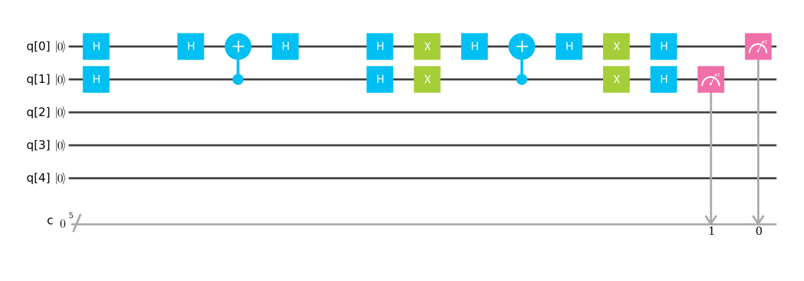
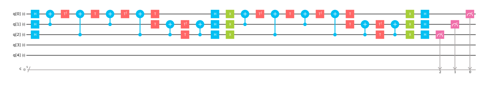
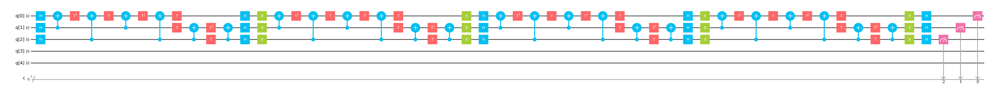

# Grover アルゴリズムについて

1996, Lov Grover, **"A fast quantum mechanical algorithm for database search"** [quant-ph/9605043](https://arxiv.org/abs/quant-ph/9605043)

> Imagine a phone directory containing N names arranged in completely random order. In order to find someone's phone number with a 50% probability, any classical algorithm (whether deterministic or probabilistic) will need to look at a minimum of N/2 names. Quantum mechanical systems can be in a superposition of states and simultaneously examine multiple names. By properly adjusting the phases of various operations, successful computations reinforce each other while others interfere randomly. As a result, the desired phone number can be obtained in only O(sqrt(N)) steps. The algorithm is within a small constant factor of the fastest possible quantum mechanical algorithm. 


> 完全にランダムな順序で並べられたN個の名前を含む電話帳を想像してみてください. 50%の確率で誰かの電話番号を見つけるためには, 古典的なアルゴリズム（決定論的であろうと確率的であろうと）は, 少なくとも N/2 名を見る必要があります. 量子力学的システムでは, 状態の重ね合わせにあり, 複数の名前を同時に調べることができます. さまざまな操作のフェーズを適切に調整することによって, 成功した計算は互いに強化し, 他はランダムに干渉します. その結果, 所望している電話番号は $$ \mathcal{O}( \sqrt{N}）$$ ステップだけで計算できます. このアルゴリズムは, 最も高速な量子力学アルゴリズムの定数倍の範囲の計算速度です. 

グローバー自身が論文の abstracts で示しているとおり, グローバーアルゴリズムの用例として, 「整列化されていないアドレス帳から, 知り合いの携帯番号を探す」のに使われると,  
一般的には「データベースの探索」と説明されています.  
しかし, この具体例を想像しながらこのアルゴリズムを学ぶと, 少し戸惑うかもしれません. グローバーアルゴリズムは, 「逆関数の導出」と言うほうがより正確かもしれません.  

すなわち, 量子コンピューターで処理できる関数 $$ y = f(x) $$ があるとき, グローバーアルゴリズムを使うと, 
ある $$ y $$ を与える $$ x $$ の値を計算することができます.  

例えば, 重ね合わせられた量子状態 $$ \psi $$ が特定の状態 $$ x $$ を含んでいる場合には, $$ 1 $$ を返し, 
含まない場合は $$ 0 $$ を返すような関数 $$ f(x, \psi) $$ を考えたとき,  
$$ x = \phi $$ の答え $$ f(\phi, \psi) $$ が $$ 0 $$ か, $$ 1 $$ かを判定するときに, 使える最も効率的な量子アルゴリズム. これがグローバーアルゴリズムです.   

  4-qubit の例 : 
  
  $$ \psi = \alpha \lvert0000\rangle + \beta \lvert0001\rangle + \gamma \lvert0010\rangle + \cdots $$
  
  のような $$ \psi $$ に, $$ \phi = \lvert0101\rangle $$ が, 含まれるかどうかを調べる問題がこのアルゴリズムの対象です.  


---
それでは, Grover アルゴリズムの特徴をみていきましょう.  
Grover アルゴリズムは, 振幅増幅手法と呼ばれる操作を行い, 目的の値 x を検出します.  

  ```
  振幅増幅手法 [Amplitude Amplification] :  
  欲しい解の確率振幅をマイナスにマーキングし, 全確率振幅の平均値の周りで逆転させる. 
  ```

  2-qubit の例 :

　　　　　　$$ \lvert\phi\rangle = \frac{1}{2}\left( \lvert00\rangle + \lvert01\rangle + \lvert10\rangle + \lvert11\rangle \right) $$
  という重ね合わせられた量子ビットがあるときに, この中から $$ \lvert10\rangle $$ を探したいという問題とします. 
  
  **手順１）** 欲しい解の確率振幅をマイナスにマーキング

　　　　　　$$ \lvert\phi\rangle_{marked} = \frac{1}{2}\left( \lvert00\rangle + \lvert01\rangle \textstyle \class{mathfont-r}{- \lvert10\rangle} + \lvert11\rangle \right) $$
  <br />
  <br />
  **手順２）** 全確率振幅の平均値の周りで逆転

　　　　　マーキングされた状態の全確率振幅 $$ \langle\alpha\rangle $$ は, $$ \left( \frac{1}{2} + \frac{1}{2} - \frac{1}{2} + \frac{1}{2} \right) / 4 = \frac{1}{4} $$ です.  

　　　　　$$ \lvert\phi\rangle^{\prime}_{marked} = \left(\frac{1}{4}-\frac{1}{2}+\frac{1}{4}\right) \lvert00\rangle + \left(\frac{1}{4}-\frac{1}{2}+\frac{1}{4}\right) \lvert01\rangle + \left(\frac{1}{4}+\frac{1}{2} +\frac{1}{4}\right) \lvert10\rangle + \left(\frac{1}{4}-\frac{1}{2}+\frac{1}{4}\right) \lvert11\rangle = \lvert10\rangle $$

　　　　　この状態 $$ \lvert\phi\rangle^{\prime}_{marked} $$ を観測すると, $$ \lvert10\rangle $$ の確率が $$ 1 $$ となり, $$ \lvert10\rangle $$ の状態を探しだすことができます.  

  2-qubit では, この手順１）, ２）を１回行えば, マーキングされた量子状態の確率振幅が 1 になりますが, N-qubit のときには, この方法を反復してマーキングした振幅を増幅します.  

  また, 問題の初期量子状態に探したい状態がわずかな確率で含まれている場合でも, 次の例のように, この手法は有効に作用します.  

  2-qubit の例（わずかな確率で検索対象が含まれている例） :  

　（問題）　$$ \lvert\phi\rangle = \frac{400\sqrt{3}}{1201} \lvert00\rangle + \frac{400\sqrt{3}}{1201} \lvert01\rangle + \frac{49}{1201} \lvert10\rangle + \frac{400\sqrt{3}}{1201} \lvert11\rangle $$  
<br />
　　　　　　$$ \lvert\phi\rangle = \textstyle \class{mathfont-r}{0.0407 \cdots} \lvert10\rangle +  0.5768 \cdots \left( \lvert00\rangle + \lvert01\rangle + \lvert11\rangle \right) $$  
<br />
　　　　　　問題の $$ \lvert10\rangle $$ の確率は, $$ \left(0.0407 \cdots\right)^{2} \approx \textstyle \class{mathfont-r}{0.166 \%} $$
<br />
<br />
　（手順１）$$ \lvert\phi\rangle_{marked} = \frac{400\sqrt{3}}{1201} \lvert00\rangle + \frac{400\sqrt{3}}{1201} \lvert01\rangle - \frac{49}{1201} \lvert10\rangle + \frac{400\sqrt{3}}{1201} \lvert11\rangle $$  
<br />
　　　　　　全確率振幅平均は, $$ \langle\alpha\rangle = \frac{1200\sqrt{3}-49}{1201\times 4} $$  
<br />
　（手順２）$$ \lvert\phi\rangle^{\prime}_{marked} = \frac{400\sqrt{3}-49}{1201\times 2} \lvert00\rangle + \frac{400\sqrt{3}-49}{1201\times 2} \lvert01\rangle + \frac{1200\sqrt{3}+49}{1201\times 2} \lvert10\rangle + \frac{400\sqrt{3}-49}{1201\times 2} \lvert11\rangle $$  
<br />
　　　　　　$$ \lvert\phi\rangle^{\prime}_{marked} = \frac{1200\sqrt{3}+49}{1201\times 2} \lvert10\rangle + \frac{400\sqrt{3}-49}{1201\times 2} \left( \lvert00\rangle + \lvert01\rangle + \lvert11\rangle \right) $$  
<br />
　　　　　　$$ \lvert\phi\rangle^{\prime}_{marked} = \textstyle \class{mathfont-r}{0.8857 \cdots} \lvert10\rangle +  0.2680 \cdots \left( \lvert00\rangle + \lvert01\rangle + \lvert11\rangle \right) $$  
<br />
　　　　　　操作後の $$ \lvert10\rangle $$ の確率は, $$ \left(0.8857 \cdots\right)^{2} \approx \textstyle \class{mathfont-r}{78.44 \%} $$
<br />

---
### Grover's Search Algorithm の数理
$$ f(x) := \begin{cases}
1 & (x = z) \\
0 & (x \neq z) \\
\end{cases}
, x \in \mathbb{Z}
$$ を考えるとき, 次の 2 つのオペレーター行列を考えます. 

【オペレーター $$ R_f $$ ：選択的回転】  
　　　　　　$$ R_f(m,n):= e^{i\pi f(x)} \delta_{mn} = (-1)^{f(x)} \delta_{mn} = \mathcal{I} - 2 \lvert z \rangle \langle z \rvert $$  

【オペレーター $$ D $$ ：平均値まわりの反転】  
　　　　　　$$ D := - \mathcal{I} + 2 \lvert \phi_0 \rangle \langle \phi_0 \rvert  $$  
　　　　　　ここでの, $$ \displaystyle \lvert \phi_0 \rangle = \frac{1}{\sqrt{N}} \sum_{x=0}^{N-1} \lvert x \rangle $$

ここで, 選択的回転 $$ R_f $$ と, 平均値まわりの反転 $$ D $$ の合成を考えると, 


　　　　　　$$ U_f := D R_f = \left( - \mathcal{I} + 2 \lvert \phi_0 \rangle \langle \phi_0 \rvert \right) 
\left( \mathcal{I} - 2 \lvert z \rangle \langle z \rvert \right) $$

これを, 状態 $$ \displaystyle \lvert \phi \rangle := \sum_{x=0}^{N-1} w_x \lvert x \rangle $$
ここで, $$ \displaystyle \left( \sum_{x=0}^{N-1} \lvert w_x \rvert^{2} = 1 \right) $$ に施すと,   


状態 $$ \lvert \phi \rangle $$ は, 次で示す状態に遷移します.   


　　　　　　$$ \displaystyle U_f \lvert \phi \rangle =
\sum_{x=0,x \neq z}^{N-1} ( 2 \overline{w} - w_x ) \lvert x \rangle + ( 2 \overline{w} + w_z ) \lvert z \rangle $$


すなわち, 目的の $$ \lvert z \rangle $$ の確率振幅が増加し, それ以外の $$ \lvert x \rangle, ( x \neq z )$$ では確率振幅が減少します.    
目的の $$ \lvert z \rangle $$ の確率振幅が十分に大きくなるまで, この操作 $$ U_f $$ を繰り返します.    

#### 反復回数についての考察

次に, どの程度の回数を繰り返せばよいかを考察します.  
操作 $$ U_f $$ を繰り返す回数を $$ k $$ として, $$ k $$ 回の $$ U_f $$ の操作をまとめて, $$ U_f^{k} $$ とおきます.   

ここで, $$ \lvert \phi \rangle $$ として, 平均値まわりの反転のときに使った $$ \lvert \phi_0 \rangle $$ を考えてみます.   
状態 $$ \lvert \phi_0 \rangle $$ に $$ U_f^{k} $$ を施すと,   

$$ \displaystyle sin \theta = \sqrt{\frac{1}{N}}, cos \theta = \sqrt{ 1 - \frac{1}{N}} $$ とおいて,  

　　　　　　$$ \displaystyle U_f^{k} \lvert \phi_0 \rangle =
sin((2k+1)\theta) \lvert z \rangle + \sum_{x \neq z}^{N-1} \frac{1}{\sqrt{N-1}}cos((2k+1)\theta) \lvert x \rangle $$
  
となります.  

$$ m := \lfloor \frac{\pi}{4 \theta} \rfloor $$ とおき, $$ U_f $$ を $$ m $$ 回施して観測したときに期待どおりの結果が得られる確率 $$ P_c $$ とすると,   

　　　　　　$$ P_c \geq 1 - \frac{1}{N} $$

で抑えられ,  このとき,  


　　　　　　$$ m = \mathcal{O}( \sqrt{N}）$$

です.  

---

具体的な例として「$$ \lvert\phi\rangle = \frac{1}{2}\left( \lvert00\rangle + \lvert01\rangle + \lvert10\rangle + \lvert11\rangle \right) $$ で表された量子ビット状態があるときに, この中から $$ \lvert11\rangle $$ を探したい」という問題を考えます. 

  **手順１）欲しい解の確率振幅をマイナスにマーキング**

　　　　　　$$ CZ (Controlled-Z) $$ オペレータを作用させれば, $$ \lvert 11\rangle $$ の符号を入れ替えられます.  
<br />
　　　　　　$$ 2^{2}\times2^{2} $$ の行列で表すと, $$ CZ =  \left( \begin{array}{cc} I & 0 \\ 0 & Z \end{array} \right) $$ . ここでの $$ I, Z $$ は,それぞれ
$$ I = \left( \begin{array}{cc} 1 & 0 \\ 0 & 1 \end{array} \right) , Z = \left( \begin{array}{cc} 1 & 0 \\ 0 & -1 \end{array} \right) $$ 
の $$ 2 \times 2 $$ の行列.  

　　　　　　この行列 $$ CZ $$ を $$ \lvert\phi\rangle $$ に作用すると,  


　　　　　　$$ CZ \lvert\phi\rangle = \frac{1}{2}\left( \lvert00\rangle + \lvert01\rangle + \lvert10\rangle - \lvert11\rangle \right) $$


  **手順２）全確率振幅の平均値の周りで逆転**

　　　　　　$$ \displaystyle D = \frac{1}{2} \left( \begin{array}{cccc} -1 & 1 & 1 & 1 \\ 1 & -1 & 1 & 1 \\ 1 & 1 & -1 & 1 \\ 1 & 1 & 1 & -1 \end{array} \right) =
\frac{1}{2} \left( \begin{array}{cc} X-I & X+I \\ X+I & X-I \end{array} \right) =
\frac{-1}{\sqrt{2}} \left( \begin{array}{cc} H & H \\ H & -H \end{array} \right)
\left( \begin{array}{cc} 0 & X \\ X & 0 \end{array} \right) 
\left( \begin{array}{cc} I & 0 \\ 0 & Z \end{array} \right) 
\left( \begin{array}{cc} 0 & X \\ X & 0 \end{array} \right) 
\frac{1}{\sqrt{2}} \left( \begin{array}{cc} H & H \\ H & -H \end{array} \right)
$$

　　　　　　$$ D \cdot CZ \lvert \phi \rangle = \frac{1}{4}\left( (-1 + 1 + 1 - 1) \cdot \lvert00\rangle + (1 - 1 + 1 - 1)  \cdot \lvert01\rangle + (1 + 1 - 1 - 1) \cdot \lvert10\rangle + (1 + 1 + 1 + 1) \cdot \lvert11\rangle \right) $$


ここで, $$ Z = H \cdot X \cdot H $$ を使うと, $$ CZ = ( I \otimes H ) \cdot CX \cdot ( I \otimes H ) $$ と書けます.   

### IBM Q を使って検証

これを IBM Q 上で表現すると以下のようになります.  実行すると, $$ \lvert 11 \rangle $$ の確率が $$ 1 $$ となります.  



次に 3-qubit の例は以下のようになります.  

＊ 3-qubit で $$ \lvert 111 \rangle $$ を $$ 1 $$ 回の試行を行なう例



＊ 3-qubit で $$ \lvert 111 \rangle $$ を $$ 2 $$ 回の試行を行なう例



### (Riggetti製) pyquil を使って検証

python環境に pyquil をインストールします.  

```bash
$ pip install pyquil
```

＊ 2-qubit から, $$ \lvert 11 \rangle $$ があるか検索する量子プログラム.   


```python
import pyquil.quil as pq
import pyquil.api as api
from pyquil.gates import *
qvm = api.SyncConnection()
p = pq.Program()
p.inst(
  H(0),
  H(1),
  H(0),
  CNOT(1,0),
  H(0),
  H(0),
  H(1),
  X(0),
  X(1),
  H(0),
  CNOT(1,0),
  H(0),
  X(0),
  X(1),
  H(0),
  H(1),
  MEASURE(0, 0),
  MEASURE(1, 1))
result = qvm.run(p,[0,0],20)
print(result)
```

---
### Grover の応用

* 複数の検索対象を同時に見つけ出すための探索 := G-BBHT

  Boyer, M., Brassard, G., Hoyer, P., Tapp, A. 1996 Tight bounds on quantum searching. In Fourth Workshop on Physics and Computation  
  (ed. T. Toffoli & M. Biaford & J. Leao), pp. 36-43. New England Complex Systems Institute.  

* $$ p = 4 k + 1 $$ の素数の探索  [Quantum Computation of Prime Number Functions (arxiv:1302.6245)](https://arxiv.org/abs/1302.6245)

  $$ \lvert i \rangle $$ の $$ i $$ が素数なら, $$ -1 $$ , 合成数なら $$ 1 $$ を返すようなオラクルを考える.  

---

### 書籍紹介

量子コンピューターを勉強するために, お薦めの図書を教えてほしいとよく質問されます.  
今回, Grover アルゴリズムに関して, 市販されている書籍で調べてこの資料を記しました. 
同じ課題について調べたことで, それぞれの図書の特徴が知れると思い, 下表にまとめました. 

|＊|表紙|タイトル|説明（Groverアルゴリズムに関する記載について）|
|:-:|:-:|:--|:--|
|◎| | [量子コンピュータと量子通信〈2〉量子コンピュータとアルゴリズム](https://www.amazon.co.jp/dp/4274200086/)<br /> Michael A. Nielsen/ Isaac L. Chuang (著) 木村 達也 (訳), オーム社<br />￥3,800, 2005/1/10 | 量子コンピューターの最も著名な教科書. <br /> Grover アルゴリズムに関しては, 第６章「量子探索アルゴリズム」で 32ページにわたり解説. <br />後半の章では, 量子コンピューターの物理的実現方法について書かれています. |
|◎| | [量子アルゴリズム](https://www.amazon.co.jp/dp/4765533433/)<br />中山 茂 (著), 技報堂出版<br />￥5,400, 2014/10/30 | Grover アルゴリズムは, 第１２章「量子探索アルゴリズム」（18ページ）のなかで解説. 量子状態の確率振幅が増大していく図が分かりやすい. また, 8 個（3 qubit）の量子回路の具体的な記載があり, 行列式や量子ビット状態の時間発展が分かりやすい. <br />同じ著者の "クラウド量子計算入門" の理論面を補填するためにはよい.  |
|◎| | [クラウド量子計算入門](https://www.amazon.co.jp/dp/4877834087/)<br />中山 茂 (著), カットシステム<br />￥5,500, 2016/10/10 | 第１３章「グローバーの探索問題の量子実験」（13ページ）で Grover アルゴリズムを具体的に IBM Q を使って, 量子回路にしながら解説しています. <br />本書全般にわたり, IBM Q の利用を想定されており, 具体的な回路を使いながら, 理論的な解説をしているのが特徴. |
|○| | [量子コンピュータの基礎数理](https://www.amazon.co.jp/dp/4339023760/)<br />上坂 吉則 (著), コロナ社<br />￥3,000, 2000/5/26 | 第６章「ファイル検索」（22ページ）で Grover アルゴリズムを解説. 全般的に数式を用いて説明されており, 数理的な説明の方が分かりやすい方にはよい. 前半の章では, 量子ゲートの例もあるが, Grover アルゴリズムなどの量子アルゴリズムに関しては, 具体的な量子回路の記載がなく, 実用例を考えるには不向き. 理論寄り. |
|○| | [今度こそわかる量子コンピューター](https://www.amazon.co.jp/dp/4061566059/)<br />西野 友年 (著), 講談社<br />￥2,900, 2015/10/23 | 第１３章「量子検索」（14ページ）が Grover アルゴリズムの解説. 数式も少なめに抑えて, 平易な例を挙げるなど理解しやすいように工夫されている. ただし, 理論的な説明は十分ではありません. <br />ほかの章でも同じように平易に書かれており, 取り扱っている範囲も広範. |
|○| | [量子情報科学入門](https://www.amazon.co.jp/dp/4320122992/)<br /> 石坂 智/ 小川 朋宏/ 河内 亮周/ 木村 元/ 林 正人 (著), 共立出版<br />￥3,800, 2012/6/10 | 「量子アルゴリズム」の章に紹介された幾つかのアルゴリズムの１つとして紹介されています. （「Grover のアルゴリズム」の項. 10ページ）定理の定義やその証明の記載があり, 数理的説明. <br />記載されている内容の範囲も多く, 数式と文章での説明のバランスがよい.  |
|○| | [量子計算 (ナチュラルコンピューティング・シリーズ)](https://www.amazon.co.jp/dp/4764904861/)<br /> 西野 哲朗/ 三原 孝志/ 岡本 龍明 (著) 萩谷 昌己/ 横森 貴 (編) , 近代科学社<br />￥4,500, 2015/10/13 | 第３章「量子デジタル計算」の１節「Grover のアルゴリズム」（12ページ）で解説. <br /> |
|△| | [マーミン 量子コンピュータ科学の基礎](https://www.amazon.co.jp/dp/4621081462/)<br /> N. David Mermin (著) 木村 元 (訳), 丸善<br />￥4,800, 2009/7/30 | 第４章（12ページ）が Grover アルゴリズムについての解説. 「$$ W $$ の構成法」が特徴的. 特定する数が複数ある場合への一般化にも言及あり. 最新の量子計算からみると, 少し古い印象です.  |
|△| | [量子コンピューティング](https://www.amazon.co.jp/dp/4627827911/)<br />  Jozef Gruska (著) 伊藤 正美/ 岩本 宙造/ 森田 憲一/ 今井 克暢/ 外山 政文 (訳) , 森北出版<br />￥8,000, 2003/11/19 | Grover アルゴリズムは, 第３章「アルゴリズム」の中で, 「量子探索と数え上げ」（13ページ）の項として解説. 検索対象 x が複数である G-BBHT 探索アルゴリズムの説明が多い. 数え上げ問題の計算量の古典アルゴリズムとの比較表が特徴的. <br />全般にわたり, 練習問題による問題提起があるものの, その問題の明確な回答がなく, 自力で解法が見つけられないと辛い内容です.  |
|△| | [量子計算と量子情報の原理](https://www.amazon.co.jp/dp/4320034317/)<br /> G.ベネンティ (著) 広岡 一 (訳), 丸善出版 <br />￥5,000, 2012/6/5 | 第３章「量子計算」の１節（8ページ）で Grover アルゴリズムを扱っています. <br />量子計算の基礎から応用の導入まで, それぞれの話題がコンパクトかつ広範に取り上げられています. |
|△| | [量子情報工学](https://www.amazon.co.jp/dp/4627853815/)<br /> 富田 章久 (著), 森北出版<br />￥3,400, 2017/2/28 | Grover アルゴリズムを一般化した「振幅増幅」を解説し, その例として Grover アルゴリズムを紹介しています. （振幅増幅の説明から5ページ） |
|ー| | [観測に基づく量子計算](https://www.amazon.co.jp/dp/4339028703/)<br /> 小柴 健史/ 藤井 啓祐/ 森前 智行 (著), コロナ社<br />￥2,800, 2017/3/10 | 測定型量子計算に関する基礎から応用までカバーした良書. Groverアルゴリズムとは異なる高度な分野を扱っており, Groverアルゴリズムの記載はありません. <br /> **OpenQLプロジェクトに参加されている藤井さんが執筆されています.** |
|ー| | [量子計算理論 量子コンピュータの原理](https://www.amazon.co.jp/dp/4627854013/)<br />森前 智行 (著), 森北出版<br />￥3,600, 2017/11/14 | 計算量に関する説明がメインで, BQPの定義や超量子計算, 非ユニバーサル計算など前衛的な内容. Grover アルゴリズムなどの基礎的な理論の記述はありません. |
|ー| | [量子コンピュータ入門(第2版)](https://www.amazon.co.jp/dp/4535788057/)<br />宮野 健次郎/ 古澤 明 (著), 日本評論社<br />￥2,500, 2016/3/10 | Shor アルゴリズムについては, １つの章をかけて詳しい解説がありますが, 残念ながら Grover アルゴリズムについては, 記述がありませんでした.<br />光を用いた量子テレポーテーションの章が特徴的. |
|ー| | [入門量子コンピュータ]()<br /> Gennady P. Berman/ Ronnie Mainieri/ Gary D. Doolen/ Vladimir I. Tsifrinovich (著) 松田 和典 (訳), パーソナルメディア<br />￥2,800, 2002/9/10 | Grover アルゴリズムや Shor アルゴリズムに関する記述はありません, イオントラップや核スピンなど, 量子コンピューターを実現するための物理系と関連する解説が多いです.  |
|ー| | [量子プログラミングの基礎](https://www.amazon.co.jp/dp/4320124057/)<br />Mingsheng Ying (著) 川辺 治之 (訳), 共立出版<br />￥6,500, 2017/3/31 | 古典 while 言語の量子プログラミングへの拡張が特徴的. <br />Groverアルゴリズムの言及はありません. |
|ー| | [量子情報の物理―量子暗号、量子テレポーテーション、量子計算](https://www.amazon.co.jp/dp/4320034317/)<br /> D.Bouwmeester (著) 小芦 雅斗/ 西野 哲朗/ 井元 信之 (訳) , 共立出版 <br />￥5,300, 2007/5/25 | Grover アルゴリズムについては, NP問題との関連で 3ページで紹介されている程度. 理論や具体的な計算の記述はありません.  |
|ー| | [量子情報科学の基礎―量子コンピュータへのアプローチ](https://www.amazon.co.jp//dp/4627827415/)<br /> 広田 修 (著), 森北出版 <br />￥3,600, 2002/4/15 | Grover アルゴリズムについての記述はありません. <br />量子コンピューター発展に至る歴史的な考察や, エンタングルメントに関する解説が多い. |
|？| | [量子コンピュータの理論―量子コンピューティング入門](https://www.amazon.co.jp/dp/4563015512/)<br />西野 哲朗 (著), 培風館<br />（入手困難）, 2002/12 | ー |
|？| | [量子コンピューティング―量子コンピュータの実現へ向けて](https://www.amazon.co.jp/dp/4431708693/)<br /> Colin P. Williams/ Scott H. Clearwater (著) 西野 哲朗/ 渡辺 昇/ 荒井 隆 (訳), シュプリンガー<br />（入手困難）, 2000/06 | ー |


（＊）オススメ度

### 付録: sympy で Grover アルゴリズムを計算してみましょう

まず, python環境に sympy をインストールします.  

```bash
$ pip install sympy
```

sympy.physics.quantum パッケージをインポートします.  

```python
>>> from sympy.physics.quantum import *
>>> from sympy.physics.quantum.gate import X,Y,Z,H,T,S,CNOT,SWAP
>>> from sympy.physics.quantum.qubit import Qubit
```
＊ 2-qubit から, $$ \lvert 11 \rangle $$ があるか検索する量子プログラム.   

```python
>>> qi = qapply(H(0)*H(1)*Qubit('00'))
>>> rf_3 = H(0)*CNOT(1,0)*H(0)
>>> d_2  = (H(0)*H(1))*(X(0)*X(1))*(H(0)*CNOT(1,0)*H(0))*(X(0)*X(1))*(H(0)*H(1))
>>> grover = d_2 * rf_3
>>> qapply( grover * qi)
-|11>
```


