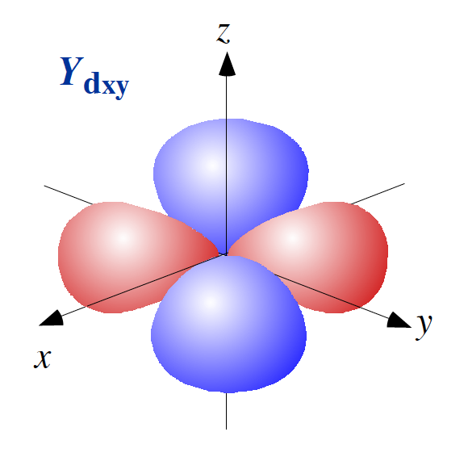

### 量子化学計算のモチベーション
**第一原理計算**

量子化学計算では, 多原子系の分子を対象とした時間を含むシュレーディンガー方程式を解くことが重要です.  

$$
\hspace{-200px}\begin{align}
i\hbar \frac{\partial}{\partial t}\phi &= H \phi \tag{1}
\end{align}
$$

ここで, Hamiltonian $$ H $$[^1] は, 

$$
\hspace{-50px}\begin{align}
H = - \underset{(1)}{\underline{\sum_I \frac{\nabla^2_{R_I}}{2M_I}}}
- \underset{(2)}{\underline{\sum_i \frac{\nabla^2_{r_i}}{2}}}
- \underset{(3)}{\underline{\sum_{I, j} \frac{Z_I}{|R_I-r_j|}}}
+ \underset{(4)}{\underline{\sum_{I, J>I} \frac{Z_I Z_J}{|R_I-R_J|}}}
+ \underset{(5)}{\underline{\sum_{i, j>i} \frac{1}{|r_i-r_j|}}} \tag{2}
\end{align}
$$

(1): 全原子核の運動エネルギー  
(2): 全電子の運動エネルギー  
(3): 電子・原子核間のクーロン引力のポテンシャルエネルギー  
(4): 原子核間のクーロン斥力のポテンシャルエネルギー  
(5): 電子間のクーロン斥力のポテンシャルエネルギー

この Hamiltonian $$ H $$ は, 時間に依存しないため, 変数分離することができ,  

$$
\hspace{-200px}\begin{align}
\phi &= \psi(r, R) \cdot C \exp{\left(-i\frac{E}{\hbar}t\right)} \tag{3}\\
\hat{H} \psi &= E\psi \tag{4}
\end{align}
$$

すなわち, $$ \hat{H} \psi = E\psi $$ から, 定数 $$ E $$ が求まれば, これを用いて全波動関数が
時間 $$ t $$ により変化する様子（時間発展）を計算することができます.  
つまり, Hamiltonian $$ \hat{H} $$ の固有値 $$ E $$ を解くことが量子化学計算の１つのモチベーションとなります.  

### 初等量子化学計算の復習

全原子系のシュレーディンガー方程式を解きたい. $$ = $$ Hamiltonian の固有値問題.  

２体問題は, 厳密解がある.  

３体問題以上の多体問題は, 厳密解を求められない!!  

* ３体問題 $$\;\;\longrightarrow$$ Born-Oppenheimer 近似[^2] を使った ほぼ厳密解
* 多体問題 $$\;\;\longrightarrow$$ 摂動法[^3] （コンピューター登場以前の計算）  
  　　　　 $$\;\;\longrightarrow$$ 変分法  

#### 変分法とは, 

式(4) に左から$$ \psi^* $$ を掛けて全空間で積分した
$$\hspace{-200px}\begin{align}
\int \psi^* \hat{H} \psi dx – E \int \psi^* \psi dx = 0 \tag{5}
\end{align}
$$

ハートリー・フォック（Hartree-Fock）近似

### トレンド : 量子コンピューターを利用する

量子化学計算では, 古典計算でできるところと量子コンピューターが得意とする計算を分けて処理することが推奨されています.  
[arxiv:1512.06860 Scalable Quantum Simulation of Molecular Energies](https://arxiv.org/abs/1512.06860)

$$\hspace{50px}\begin{align}\textrm{Classical Preparation} & \begin{cases}
& \textrm{Real Space Molecular Hamiltonian} \\
& \downarrow \\
& \textrm{Born-Oppenheimer Approximation} \\
& \downarrow \\
& \textrm{Compute Orbitals, Hartree-Fock State} \\
& \downarrow \\
& \textrm{Write in Second Quantized Orbital Basis} \\
& \downarrow \\
& \textrm{Bravyi-Kitaev Transform} \\
\end{cases} \\
& \downarrow \\
& \textbf{Quantum Calculation} \begin{cases}
& \textbf{Pahse Estimation Algorithm (PEA)} \\
& \textbf{Variational Quantum Eigensolver (VQE)} \\
\end{cases}
\end{align}
$$

### 論文を読むときの Keyword (1)

論文にある化学計算における用語に関する知識が必要となります. その用語を一部列挙します. （専門外向け）

|Keyword|Description|
|:--|:--|
|VQE(QVEとも)| Variational Quantum Eigensolver, 量子固有値変分法 |
|PEA|Pahse Estimation Algorithm, 位相推定アルゴリズム |
|STO-3G||
|UCC||
|RDM|reduced density matrix |

### 論文を読むときの Keyword (2)

|Keyword|Description|
|:--|:--|
|Hartree|エネルギーの単位[^1] ボーア半径の距離を隔てた2つの電荷素量が持つポテンシャルエネルギー|
|SCF法|Self Consistent Field 法 Hartree-Fock方程式（Hamilton方程式の一種）から得られた近似解を使って, 再帰的に解く手法. これにより多粒子系のフェルミ粒子全体の作る平均場において, その中で運動する１つのフェルミ粒子の波動関数を自己無撞着（Self Consistent）に決定することができる.|

### どんな分子における研究段階か？

現時点では, 次のような小さな分子系でしか研究が進んでいないのが実情.  

$$H_2$$

量子コンピューターの実例（ライブラリの利用用途を示すためのサンプル）も多く提示されてきている.  

$$LiH$$

[arxiv:quant-ph/0604193 Simulated Quantum Computation of Molecular Energies](https://arxiv.org/abs/quant-ph/0604193)  
[arxiv:1704.05018 Hardware-efficient Variational Quantum Eigensolver for Small Molecules and Quantum Magnets](https://arxiv.org/abs/1704.05018)  

$$BeH_2$$

[arxiv:1507.08969  Towards Practical Quantum Variational Algorithms](https://arxiv.org/abs/1507.08969)  

$$HeH^{+}$$

[arxiv:1405.2696 Quantum Simulation of Helium Hydride in a Solid-State Spin Register](https://arxiv.org/abs/1405.2696)  

### Hamiltonian を量子コンピューターに投入できる形にする

### 制御ユニタリー（Controlled Unitrary）

### 量子化学計算分野における巨人たちのアプローチ

### OpenFermion の利用

### OpenFermion パッケージ群

ops :

hamiltonian : 

measurements : 

transform : 

utils : 

data : 

#### OpenFermion - ops

* FermionOperator

* QubitOperator

* InteractionOperator

#### OpenFermion - hamiltonian

#### OpenFermion - measurements

#### OpenFermion - transform

* Bravyi-Kitaev Super facst transform

* Jordan-Wigner tranform

* Verstraete-Cirec tranform

* Fenrick Tree Node

#### OpenFermion - utils / data

* Grid

* unitray_cc 群

### Microsoft と IBM の取り組み
#### Q# の利用

Q# は, 量子アプリケーションを開発することを目指した言語として開発されており, ドキュメントやサンプル・プログラムなども充実しています.  
Microsft は, 早い段階から LiQi|> の開発も含め Google からは先行していたため, 参照している論文なども古いままのものもあり, 老舗感がでています.  

* Q#のマニュアル [Hamiltonian Simulation](https://docs.microsoft.com/en-us/quantum/libraries/applications)  
 Tipsにはリンク切れもあり, 十分整備されているというわけではありません.  

* krosuke1001 さんのQiitaブログ記事 [Microsoft Qunatum Simulator を触ってみた　#2](https://qiita.com/krosuke1001/items/4cd826d28ae4d145e526)

* GitHub にあるサンプル・プログラム[https://github.com/Microsoft/Quantum/tree/master/Samples/H2SimulationCmdLine](https://github.com/Microsoft/Quantum/tree/master/Samples/H2SimulationCmdLine)

#### QISKit の利用

QISKit を使った量子化学計算が提案されています. 手法論や関連論文がブログで紹介されています.  
[The Variational Quantum Eigensolver: An unsung hero of approximate quantum computing](https://developer.ibm.com/dwblog/2017/quantum-computing-qubit-vqe-variational-quantum-eigensolver/)

> Here’s what it looks like to use VQE to calculate bond length in a molecule (e.g. BeH2) using a quantum computer:  
>  
> 1. Transform the Hamiltonian of the molecule to a qubit Hamiltonian. This means taking your representation of the electronic orbital interactions in the molecule and figuring out how to mimic key parts of it in the qubit system. Qualitatively, you can think of the interactions among electronic orbitals in the molecules as being captured by our ability to create entanglement in the qubit system. The larger the molecule you are trying to simulate, the more electronic orbitals you have, so the more qubits you need.
>
> 2. Pick a “trial wavefunction,” or trial state, and encode it onto the quantum computer. Imagine that this trial state is a guess to the electronic configuration (since you don’t know the answer for the real molecule yet) of BeH2 at a given inter-atomic distance. Create a quantum state on the processor that represents that particular version of the BeH2 wavefunction by using a combination of entangling gates, single-qubit gates, and your choice of circuit depth (the number of sequential operations you can do, constrained by the available hardware).
>
>3. Estimate the energy of the trial state. This is done by measuring aspects of the quantum state you created in the previous step. Given what you know about the molecule’s Hamiltonian, you can relate this back to an energy in the molecule for that given electronic configuration.  
>
>4. Feed this energy to an optimizer that is run on a classical computer. The optimizer then generates a new set of control parameters that create a new trial wavefunction on the quantum computer with lower energy. Rinse and repeat until the energy converges to the lowest value; this final energy corresponds to the solution to the ground state energy for the interatomic spacing you tried. (In the case of BeH2, the molecule is small enough to compare against results on a conventional computer.)
>
>5. Repeat steps 2-4 for Hamiltonians corresponding to different inter-atomic spacings. The Hamiltonian with the least energy would then correspond to the equilibrium configuration, and voila! You know the bond length.
>The ability to use a quantum computer to perform tasks that are typically hard for classical computers (like creating a trial state and measuring its energy), is an important part of why this approach is so promising. Of course, it’s early days and there are many hurdles to overcome, but, it’s an exciting start and we expect this approach will scale.

実際の実例も提示されています. 
[VQE algorithm: Application to quantum chemistry](https://github.com/QISKit/qiskit-tutorial/blob/master/4_applications/quantum_chemistry.ipynb)

#### 論文を読むときのコツ

* 対象としている分子系を把握すること.  
* 量子コンピューター実現のための実験データを載せた研究論文も多い.  

　専用機・・・大規模な系の計算が目指せる可能性も  
　　　　　　　（最適化解というアプローチでは, Ising Machine も有用）  
　汎用機・・・効率化（Depth）  

[arxiv:1706.00023 Low Depth Quantum Simulation of Electronic Structure](https://arxiv.org/abs/1706.00023)  
[arxiv:1711.04789 Quantum Simulation of Electronic Structure with Linear Depth and Connectivity](https://arxiv.org/abs/1711.04789)  
[arxiv:1801.01053 Low-depth circuit ansatz for preparing correlated fermionic states on a quantum computer](https://arxiv.org/abs/1801.01053)  

* 今後, 量子回路だけを扱う研究論文も増えるであろう.  

#### 量子化学計算分野における量子コンピューター利用の今後

静的な分子軌道論　$$\longrightarrow$$ 高分子を対象  
　　　　　　　　　$$\longrightarrow$$ 複雑な化学反応を対象  

　　　　　　　　　　　　動分子力学法, モンテカルロ法 への量子コンンピューターの適用

---

[^1]: $$ \hspace{-150px}\begin{align}
    & \hbar, e, m_e \textrm{の物理定数を} 1 ( 4\pi \epsilon_0  \textrm{も} 1) \textrm{とするハートリー原子単位系 } \\
    & 1 E_h \,= \frac{e^2}{a_0} \;(\overset{hartree}{=} 1 \left[hartree\right]),\quad\quad \big( a_0 = \frac{\hbar^2}{m_e e^2} \;(\overset{hartree}{=} 1 \left[a.u.\right]) \big) 
    \end{align}
    $$

[^2]: 原子核の質量が, 電子のそれに比べて非常に大きいことを利用した近似

[^3]: $$ \hspace{-150px}\begin{align}
    & \textrm{解きたい問題の Hamiltonian}\; H \textrm{が, } \\
    & H = H_0 + V \\
    & \textrm{と書かれ, }  H_0 \textrm{については解かれている. すなわち, } \\
    & H_0\psi_n^{(0)} = E_n^{(0)}\psi_n^{(0)} \\
    & \textrm{の解 } \psi_n^{(0)} \textrm{と} E_n^{(0)} \textrm{が既知であるとするとき, 元の問題} \\
    & H_0\psi_n = E_n\psi_n \textrm{の解は, 次のように} \psi_n^{(0)} \textrm{と} E_n^{(0)} \textrm{で表せる. } \\
    & E_n = E_n^{(0)} +  \langle \psi_n^{(0)} | V | \psi_n^{(0)} \rangle + \sum_{k \neq n}\frac{\lvert \langle \psi_n^{(0)} | V | \psi_k^{(0)} \rangle \rvert^2}{E_n^{(0)}-E_k^{(0)}} + \cdots  \\
    & \psi_n = \psi_n^{(0)} + \sum_{k \neq n} \frac{\langle \psi_n^{(0)} | V | \psi_k^{(0)} \rangle }{E_n^{(0)}-E_k^{(0)}} + \cdots \\
    & \textrm{ただし, } E_n^{(0)} \textrm{に縮退はないものとする. （縮退がある場合の摂動法は, もう少しだけ工夫が必要. ）} \\
    & \textrm{右辺の第 2 項までを考慮する近似を１ 次の摂動法, 第 3 項まで入れたのを 2 次の摂動法と呼ぶ. } \\
    & \textrm{摂動法は非摂動ハミルトニアンの厳密解が知られていないときは適用できない.  }  \\
    \end{align}
    $$

