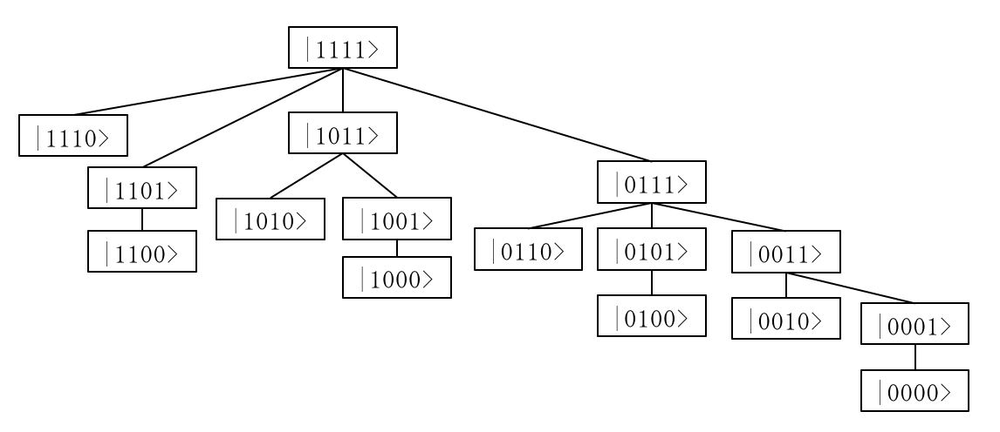
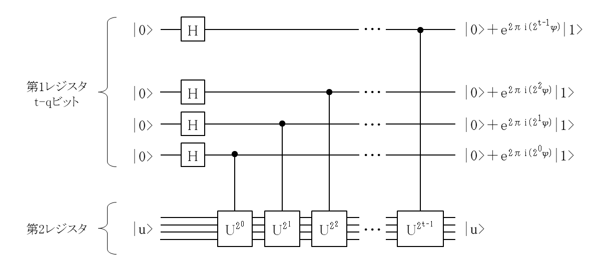
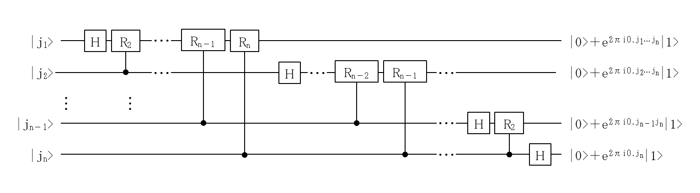
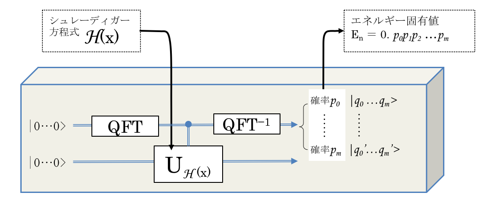

### 量子化学計算のモチベーション
**第一原理計算**

量子化学計算では, 多原子系の分子を対象とした時間を含むシュレーディンガー方程式を解くことが重要です.  

$$
\hspace{-100px}\begin{align}
i\hbar \frac{\partial}{\partial t}\phi &= H \phi \tag{1}
\end{align}
$$

ここで, Hamiltonian $$ H $$[^1] は, 

$$
\hspace{-50px}\begin{align}
H = - \underset{(1)}{\underline{\sum_I \frac{\nabla^2_{R_I}}{2M_I}}}
- \underset{(2)}{\underline{\sum_i \frac{\nabla^2_{r_i}}{2}}}
- \underset{(3)}{\underline{\sum_{I, j} \frac{Z_I}{|R_I-r_j|}}}
+ \underset{(4)}{\underline{\sum_{I, J>I} \frac{Z_I Z_J}{|R_I-R_J|}}}
+ \underset{(5)}{\underline{\sum_{i, j>i} \frac{1}{|r_i-r_j|}}} \tag{2}
\end{align}
$$

(1): 全原子核の運動エネルギー  
(2): 全電子の運動エネルギー  
(3): 電子・原子核間のクーロン引力のポテンシャルエネルギー  
(4): 原子核間のクーロン斥力のポテンシャルエネルギー  
(5): 電子間のクーロン斥力のポテンシャルエネルギー

この Hamiltonian $$ H $$ は, 時間に依存しないため, 変数分離することができ,  

$$
\hspace{-100px}\begin{align}
\phi &= \psi(r, R) \cdot C \exp{\left(-i\frac{E}{\hbar}t\right)} \tag{3}\\
\hat{H} \psi &= E\psi \tag{4}
\end{align}
$$

すなわち, $$ \hat{H} \psi = E\psi $$ から, 定数 $$ E $$ が求まれば, これを用いて全波動関数が
時間 $$ t $$ により変化する様子（時間発展）を計算することができます.  
つまり, Hamiltonian $$ \hat{H} $$ の固有値 $$ E $$ を解くことが量子化学計算の１つのモチベーションとなります.  

### 初等量子化学計算の復習

全原子系のシュレーディンガー方程式を解きたい. $$ = $$ Hamiltonian の**固有値問題**.  

２体問題は, 厳密解がある.  


３体問題以上の多体問題は, 厳密解を求められない!!  

* ３体問題 $$\;\;\longrightarrow$$ Born-Oppenheimer 近似[^2] を使った ほぼ厳密解
* 多体問題 $$\;\;\longrightarrow$$ 摂動法[^3] （コンピューター登場以前の計算）  
  　　　　 $$\;\;\longrightarrow$$ 変分法  $$\;\;\longrightarrow$$ 密度汎関数法[^4][^5]  

#### 変分法とは, 

式(4) に左から$$ \psi^* $$ を掛けて全空間で積分した

$$\hspace{-100px}\begin{align}
\langle \psi^* \vert \hat{H} \vert \psi \rangle – E \langle \psi^* \vert \psi \rangle = 0 \tag{5}
\end{align}
$$

を考えます. $$ \psi $$ は規格化されているため, $$ \langle \psi^* \vert \psi \rangle = 1 $$ . すなわち, 

$$\hspace{-100px}\begin{align}
\langle \psi^* \vert \hat{H} \vert \psi \rangle = E \tag{6}
\end{align}
$$

この方程式における固有値を $$ E_0, E_1, \dots $$ として, それぞれに対応する固有ベクトルを $$ \phi_0, \phi_1, \dots $$ とします.  
$$ \phi_i $$ は規格直交性があり, $$ \psi $$ は, 次のように表せます.  

$$\hspace{-100px}\begin{align}
\psi = \sum_i a_i \phi_i  \tag{7}
\end{align}
$$

この $$ \phi_i $$ を使って, 式 (6) は,  

$$\hspace{-50px}\begin{align}
E &= \langle \psi^* \vert \hat{H} \vert \psi \rangle \\
&= a_0^* a_0 \langle \phi_0^* \vert \hat{H} \vert \phi_0 \rangle + a_1^* a_1 \langle \phi_1^* \vert \hat{H} \vert \phi_1 \rangle + a_2^* a_2 \langle \phi_2^* \vert \hat{H} \vert \phi_2 \rangle + \cdots \\
&= a_0^* a_0 E_0 + a_1^* a_1 E_1 + a_2^* a_2 E_2 + \cdots \\
\tag{8}
\end{align}
$$

ここで, $$ E_0 \lt E_1 \lt E_2 \lt \cdots $$ であり, また, $$ a_i^* a_i \ge 0 $$ から,  

$$\hspace{-100px}\begin{align}
E &= \langle \psi^* \vert \hat{H} \vert \psi \rangle \ge \big( \sum_i a_i^* a_i \big) E_0 = E_0 \\
\tag{9}
\end{align}
$$

この式 (9) の等号が成立するように, $$ \psi $$ を $$ \phi_0 $$ に近づけられるようにすればよい. 式 (9) を「変分原理」といいます.   
つまり, 式 (6) の左辺の最小値を求めることが, 固有値問題の第一歩となります. （**最小値問題, 最適化問題**）   

次に, エネルギー $$ E $$ を波動関数 $$ \psi $$ の汎関数（関数の関数）と考えると, 

$$\hspace{-100px}\begin{align}
E(\psi) &= \frac{\langle \psi^* \vert \hat{H} \vert \psi \rangle}{\langle \psi^* \vert \psi \rangle} \\
\tag{10}
\end{align}
$$

次の変分方程式は, 元のシュレーディンガー方程式と等価であることが分かっています.  

$$\hspace{-100px}\begin{align}
\delta E(\psi) &= 0 \\
\tag{11}
\end{align}
$$

変分原理が正しいエネルギー固有値を与えるのは, 波動関数が真の波動関数である場合であり, 
真の波動関数に近いほど, $$ E(\psi) $$ は正しいエネルギー固有値 $$ E $$ に近づきます. 
しかし, 私たちは真の波動関数を知りません. 
そこで, 未知のパラメータを含む適当な有限ヒルベルト空間で波動関数を表現するような関数を仮定します. 
この仮定した関数を, 試行関数（trial function）と呼びます.  


#### Hartree-Fock 法とは, 

Hartree-Fock 法は, 変分法の具体的な方式です.  
多電子系を表す Hamiltonian の固有関数（波動関数）を一個のスレーター行列式で近似（ハートリー・フォック（Hartree-Fock）近似）できると仮定した場合に, 
問題の Hamiltonian を次の Hartree-Fock 方程式として, 解を求める方式です.  

$$\begin{align}
- \frac{1}{2m} \nabla^2 \varphi_i(x) + V_H(x)\varphi_i(x) - \int dy V_E(x,y)\varphi_i(y) = \epsilon_i \varphi_i(x) \tag{12}\\
\end{align}
$$


このハートリー・フォック法の問題は, 多電子系の記述をたった一つのスレーター行列式で表したことに課題があり, 
ポスト・ハートリー・フォック法として, 次のような手法が登場して用いられています.  

* 配置間相互作用法（configuration interaction method, CI法）  
  多電子系における Born-Oppenheimer 近似のもとで非相対論的シュレーディンガー方程式を解くために用いられる線形変分的なポスト・ハートリー・フォック法  

* メラー＝プレセット法（Møller - Plesset method）  
  レイリー・シュレーディンガーの摂動論を用いて電子相関を考慮する方法  

* 結合クラスター法（Coupled Cluster, CC法）  
  ハートリー・フォック分子軌道法を基本にして, 電子相関を考慮する指数関数クラスター演算子を使って多電子波動関数を構成する  


### トレンド : 量子コンピューターを利用する

量子化学計算では, 古典計算でできるところと量子コンピューターが得意とする計算を分けて処理することが推奨されています.  
[arxiv:1512.06860 Scalable Quantum Simulation of Molecular Energies](https://arxiv.org/abs/1512.06860)

$$\hspace{50px}\begin{align}\textrm{Classical Preparation} & \begin{cases}
& \textrm{Real Space Molecular Hamiltonian} \\
& \downarrow \\
& \textrm{Born-Oppenheimer Approximation} \\
& \downarrow \\
& \textrm{Compute Orbitals} \\
& \quad\quad \cdot \textrm{Hartree-Fock Approximation} \\
& \quad\quad \cdot \textrm{Bogoliubov transformation} \\
& \downarrow \\
& \textrm{Write in Second Quantized Orbital Basis} \\
& \downarrow \\
& \textrm{Transform electronic Hamiltonian to qubit Hamiltonian} \\
& \quad\quad \cdot \textrm{Bravyi-Kitaev Transform:} \mathcal{O}(\log{n}) qubits \\
& \quad\quad \cdot \textrm{Jordan-Wigner Transform:} \mathcal{O}(n) qubits \\
\end{cases} \\
& \downarrow \\
& \textbf{Quantum Calculation} \begin{cases}
& \textbf{Variational Quantum Eigensolver (VQE)} \\
& \textbf{Pahse Estimation Algorithm (PEA)} \\
\end{cases}
\end{align}
$$


### 論文を読むときの Keyword (1)

論文にある化学計算における用語に関する知識が必要となります. その用語を一部列挙します. （専門外向け）

|Keyword|Description|
|:--|:--|
|VQE(QVEとも)| Variational Quantum Eigensolver, 量子固有値変分法<br/>|
|PEA|Pahse Estimation Algorithm, 位相推定アルゴリズム<br/>|
|UCC|Unitary Coupled Cluster<br/>|
|RDM|reduced density matrix<br/>|

### Hamiltonian を量子コンピューターに投入できる形にする

問題の Hamiltonian を量子ビットと量子ゲート操作で表します.  
詳しくは, The Bravyi-Kitaev transformation for quantum computation of electronic structure [arxiv:1208.5986](https://arxiv.org/abs/1208.5986) を参照.  

* Jordan-Winger Transform

  1 フェルミ粒子（電子）を 1 Qubit に割り当てて Hamiltonian を変換する手法です.  
  k 番目のフェルミ粒子に対する生成（消滅）演算子は,  
  $$ \hspace{-50px}\begin{align}
  a_k \rightarrow \Big( \prod_{j=0}^{k-1} Z_j \Big) \lvert 0 \rangle \langle 1 \rvert_k \ \,,\quad
  a_k^{\dagger} \rightarrow \Big( \prod_{j=0}^{k-1} Z_j \Big) \lvert 1 \rangle \langle 0 \rvert_k
  \end{align}\tag{13}
  $$

* Bravyi-Kitaev Transform

  まず, Fenwick tree と呼ばれるツリー構造の Qubit を考えます.  
  1 フェルミ粒子（電子）を, その構造に対応した Qubit に割り当てて Hamiltonian を変換する手法です.  

  

  j 番目の Qubit に対する生成（消滅）演算子は, 複雑です. 式では次のように表されます.  
  $$ \hspace{-50px}\begin{align}
  c_j = a_j + a_j^{\dagger} & \rightarrow Z_{P(j)} X_j X_{U(j)} \\
  d_j = i \Big( a_j^{\dagger} - a_j \Big) & \rightarrow Z_{P(j)/F(j)} Y_j X_{U(j)} = Z_{C(j)} Y_j X_{U(j)} \\
  \end{align}\tag{14}
  $$

  【水素分子の例】

$$
\begin{align}
& H_2 \textrm{Hamiltonian} \\
& H = g_o\mathbb{1}+g_1Z_o+g_2Z_1+g_3Z_0Z_1+g_4Y_0Y_1+g_5X_0X_1  \\
\end{align}\tag{15}
$$

### 制御ユニタリー（Controlled Unitrary）

量子化学計算で使われる Phase Estimation Algorithm （位相推定アルゴリズム）は, 通常の量子情報の教科書にある位相推定です.  
固有ベクトル $$ \lvert u \rangle $$ とその固有値 $$ \lambda = \exp^{2 \pi i \phi} ( 0 \lt \phi \lt 1) $$ をもったユニタリー変換 $$ U $$ が与えられたとき,  
$$\begin{align}
U \lvert u \rangle = \lambda \lvert u \rangle = \exp^{2 \pi i \phi} \lvert u \rangle = \exp^{ 2 \pi i (0.a_0a_1 \dots a_n)} \lvert u \rangle
\end{align}
$$
となり, 固有値ベクトル $$ \lvert u \rangle $$ も固有値 $$ \lambda $$ も, ユニタリー変換 $$ U $$ も不明でも, その位相 $$ \phi $$ を $$ n $$ ビットの精度で推定するアルゴリズムです.  
その際には, 量子フーリエ変換（QFT, Quantum Fourier Transform）と, 制御ユニタリー（Controlled Unitary）操作が重要な役割を担います.  



### 量子変分法による固有値計算（Variational Quantum Eigensolver）

1. Transform the Hamiltonian of the molecule to a qubit Hamiltonian.   
2. Pick a “trial wavefunction,” or trial state, and encode it onto the quantum computer.   
3. Estimate the energy of the trial state. This is done by measuring aspects of the quantum state you created in the previous step.    
4. Feed this energy to an optimizer that is run on a classical computer.
The optimizer then generates a new set of control parameters that create a new trial wavefunction on the quantum computer with lower energy.
5. Repeat steps 2-4 for Hamiltonians corresponding to different inter-atomic spacings.   

[IBM Blogより](https://developer.ibm.com/dwblog/2017/quantum-computing-qubit-vqe-variational-quantum-eigensolver/)




### 論文を読むときの Keyword (2)

論文にある化学計算における用語に関する知識が必要となります. その用語を一部列挙します. （専門外向け）

|Keyword|Description|
|:--|:--|
|Hartree|エネルギーの単位[^1]<br/>ボーア半径の距離を隔てた2つの電荷素量が持つポテンシャルエネルギー|
|STO-nG基底関数系|単一のスレーター型軌道（STO）に対してn個の原始ガウス型軌道をフィッティングする系. nは2から6の値. 最も広く使われている基底関数系はSTO-3G.STO-3Gは, 水素からキセノンまでの全ての原子に対して利用可能. STO-3Gは, 3つの原始ガウス関数の線形結合で表され, その結合係数は既知. |
|ボゴリューボフ変換|Bogoliubov transformation<br/>正準交換関係代数（または正準反交換関係代数））の或るユニタリ表現から他のユニタリ表現への交換関係代数の同型により引き起されるユニタリ変換. |
|SCF法|Self Consistent Field 法<br/>Hartree-Fock方程式（Hamilton方程式の一種）から得られた近似解を使って, 再帰的に解く手法. これにより多粒子系のフェルミ粒子全体の作る平均場において, その中で運動する１つのフェルミ粒子の波動関数を自己無撞着（Self Consistent）に決定することができる.|


### どんな分子における研究段階か？

現時点では, 次のような小さな分子系でしか研究が成果が提示されていないのが実情.  

* $$ H_2$$

量子コンピューターの実例（ライブラリの利用用途を示すためのサンプル）も多く提示されてきている.  

* $$ LiH $$

[arxiv:quant-ph/0604193 Simulated Quantum Computation of Molecular Energies](https://arxiv.org/abs/quant-ph/0604193)  
[arxiv:1704.05018 Hardware-efficient Variational Quantum Eigensolver for Small Molecules and Quantum Magnets](https://arxiv.org/abs/1704.05018)  

* $$ BeH_2 $$

[arxiv:1507.08969  Towards Practical Quantum Variational Algorithms](https://arxiv.org/abs/1507.08969)  

* $$ HeH^{+}$$

[arxiv:1405.2696 Quantum Simulation of Helium Hydride in a Solid-State Spin Register](https://arxiv.org/abs/1405.2696)  


### 量子化学計算分野における巨人たちのアプローチ

* IBM : QISKit の利用を推進

* Microsoft : Q# をリリース

* Google : OpenFermion を提供


### OpenFermion の利用

[arxiv:1710.07629](https://arxiv.org/abs/1710.07629) より,   

> 物性化学や材料化学における量子シミュレーションは, 直近のエラー耐性の量子デバイスの利用分野では, 重要な用途であると予測されています. 
> しかし, 現時点では, これらの問題のアルゴリズムの開発と研究は, 化学領域と量子アルゴリズムの両方で必要とされる知識が非常に多いため, 困難な領域です. 
> このギャップを埋め, より多くの研究者にフィールドを広げるために, OpenFermionソフトウェアパッケージ（www.openfermion.org）を開発しました.
> 
> OpenFermionは、量子ソフトウェア上でのフェルミニックモデルと量子化学問題のシミュレーションを可能にすることを目的として開発された 
> Apache 2.0 ライセンスのもとでPythonで主に書かれたオープンソースのソフトウェアライブラリです. 
> 
> 一般的な電子構造パッケージとのインタフェースから始めて, 量子コンピューター上の電子構造問題を解決または研究するための分子構造と
> 量子回路との間の変換を簡素化し, この領域を研究するために必要な専門知識の量を最小限に抑えるように作られています. 
> 
> このパッケージは, ドキュメント化やテストで高いソフトウェア標準を維持しながら, 拡張性と堅牢性を備えて設計されています. 
> このリリース・ペーパーは, OpenFermionの設計選択の背後にある主な動機を概説し, OpenFermionの基本的な機能について議論します.  

量子化学計算のためのライブラリですから, 量子コンピューターの実機やシミュレーターを利用する部分は, プラグインを利用するように設計されています.  

**量子化学計算の問題（Hamiltonian）**  
↓  
**OpenFermion による Hamiltoian の変換（＝Qubitで表されたHamiltoianやOperatorに）**   
↓  
**実機で計算（plugin を利用する）**   

$$
\hspace{-50px}\begin{align} & \textrm{plugins} \begin{cases}
\textrm{pyQuil}   &\longrightarrow \textrm{Rigetti Forest-API} \\
\textrm{ProjectQ} &\longrightarrow \textrm{ProjectQ simulator} \\
\end{cases} \\
& \textrm{output quantum circuit; OpenQASM} \longrightarrow \textrm{IBM Q} \\
\end{align}
$$


### OpenFermion パッケージ群

```
ops : Hamiltonian を表すためのデータ構造を提供. 生成・消滅演算子（つまりは複素行列）を定義しています.   

hamiltonian : 化学計算に有用な Hamiltonian が提供されています.  

transform : 電子系の Hamiltonian を量子ビット系の Hamiltonian に変換するための機能が提供されています.  

measurements : RDM制約条件を使った reduce operator を提供します.  

utils : ユーテリティとしてのツール群.  

data : STO-3G の数値データが HDF5フォーマットで提供されています.  
```

#### OpenFermion - ops

* FermionOperator

  FermionOperator は, Fermion Ladder 演算子を格納します.  
  FermionOperator('1^') は, $$ a_1^{\dagger} $$ , FermionOperator('0')は, $$ a_0 $$ を表します. 
  
  $$\begin{align}
  \textrm{''}\rightarrow \mathbb{1}\quad \textrm{'2'}\rightarrow a_2\quad \textrm{'4^ 9'}\rightarrow a_4^{\dagger} a_9\quad \textrm{'4^ 3 9 3^'}\rightarrow a_4^{\dagger} a_3 a_9 a_3^{\dagger}
  \end{align}
  $$

```
O_1 = FermionOperator('')
O_2 = FermionOperator('2')
O_3 = FermionOperator('4^ 9')
O_4 = FermionOperarot('4^ 3 9 3^')
```

* QubitOperator

  QubitOperator は, Pauli Spin 演算子を格納します.  

  例えば, 次のような演算子を QubitOperator を使って以下のように表します.  

  $$\begin{align}
  O = Z_1 Z_2 + X_1 + X_2
  \end{align}
  $$


```
O = QubitOperator('Z1 Z2') + QubitOperator('X1') + QubitOperator('X2')
```

* InteractionOperator

  分子を計算するために２体の相互作用を表す Hamiltonian. 

  $$\begin{align}
   constant + \sum_{p, q} h_{[p, q]} a^{\dagger}_p a_q +
   \sum_{p, q, r, s} h_{[p, q, r, s]} a^{\dagger}_p a^{\dagger}_q a_r a_s.
  \end{align}
  $$


#### OpenFermion - hamiltonian

* MolecularData  

  古典的な電子構造から得られる分子データを格納するためのクラス.  
  場合によっては, 10MBを超える全データを個別に保存する必要があります. 保存されるデータはHDF5フォーマットです.  
  この ModecluarData を作ったり, 扱うための関数も提供されています.  

* Hubbard Model

  Fermi_hubbard 関数. Fermi-Hubbard Hamiltonian を表します.  

* Plane Wave Hamiltonian

  plane_wave_hamiltonian 関数. 一般形式の FermionOperator としての Hamiltonian を扱えるようにしています.  

* Jordan Wigner Hamiltonian

  jordan_wigner_dual_basis_hamiltonian 関数. QubitOperatoer としての Hamiltonian を扱えます.  

* Mean Field Hamiltonian

  mean_field_dwave 関数. BCS mean-field d-wave Hamiltonian を表します.  
  $$
    H = - t \sum_{\langle i,j \rangle} \sum_\sigma
            (a^\dagger_{i, \sigma} a_{j, \sigma} +
             a^\dagger_{j, \sigma} a_{i, \sigma})
        - \sum_{\langle i,j \\rangle} \Delta_{ij}
          (a^\dagger_{i, \uparrow} a^\dagger_{j, \downarrow} -
           a^\dagger_{i, \downarrow} a^\dagger_{j, \uparrow} +
           a_{j, \downarrow} a_{i, \uparrow} -
           a_{j, \uparrow} a_{i, \downarrow})
  $$

  ※「D-Waveとは関係なく, 高温超電導の理論で見ることができるd波超電導に関するもの」と @candidusflumen さんにご指摘いただきました. 

#### OpenFermion - measurements

* one_body_fermion_constraints

  Generates one-body positivity constraints on fermionic RDMs.

* two_body_fermion_constraints

  Generates two-body positivity constraints on fermionic RDMs.

#### OpenFermion - transform

* Bravyi-Kitaev (Super fast) transform

  Bravyi-Kitaev Transform / BKSF（Bravyi-Kitaev Super Fast transform）のための関数.  

* Jordan-Wigner tranform / reverse Jordan-Wigner tranform

  Jordan-Wingner Transform のための関数.  
  $$\begin{align}
  a_j^\dagger -> Z_0 \dots Z_{j-1} (X_j - iY_j) / 2 \\
  a_j -> Z_0 \dots Z_{j-1} (X_j + iY_j) / 2
  \end{align}
  $$

* Verstraete-Cirec tranform

  （紹介していませんが）Verstraete-Cirac Transform のための関数.  

* Fenwick Tree Node / Tree

  Bravyi-Kitaev Transform のための Fenwick Tree を構成するためのクラス.  
  Operator Locality in Quantum Simulation of Fermionic Models [arXiv:1701.07072](https://arxiv.org/abs/1701.07072)


#### OpenFermion - utils / data

* Grid

  原子の位置を表現するための 多次元のグリットとその点（位置）.  

* Trotter 関数群

  トロッター展開を支援するツール群.  

* UCCSD 演算子関連

  UCCSDを操作するための関数群.  
  例）uccsd_generator(FermionOperator): UCCSD波動関数を生成するための非エルミート演算子. 


### OpenFermion のサンプル

[OpenFermion/examples/openfermion_demo.ipynb](https://github.com/quantumlib/OpenFermion/blob/master/examples/openfermion_demo.ipynb)

[OpenFermion Tutorial Examples](http://openfermion.readthedocs.io/en/latest/examples.html)

[OpenFermion Manual (PDF)](https://media.readthedocs.org/pdf/openfermion/latest/openfermion.pdf)

  ※このPDFにあるサンプルプログラムを python のファイルにしてあります. [X](https://github.com/kyamaz/my_notes_of_quantum_algorithm/tree/master/ja/sample/openfermion) 

### Microsoft と IBM の取り組み
#### Q# の利用

Q# は, 量子アプリケーションを開発することを目指した言語として開発されており, ドキュメントやサンプル・プログラムなども充実しています.  
Microsft は, 早い段階から LiQi|> の開発も含め Google からは先行していたため, 参照している論文なども古いままのものもあり, 老舗感がでています.  

* Q#のマニュアル [Hamiltonian Simulation](https://docs.microsoft.com/en-us/quantum/libraries/applications)  
 Tipsにはリンク切れもあり, 十分整備されているというわけではありません.  

* krosuke1001 さんのQiitaブログ記事 [Microsoft Qunatum Simulator を触ってみた　#2](https://qiita.com/krosuke1001/items/4cd826d28ae4d145e526)

* GitHub にあるサンプル・プログラム[https://github.com/Microsoft/Quantum/tree/master/Samples/H2SimulationCmdLine](https://github.com/Microsoft/Quantum/tree/master/Samples/H2SimulationCmdLine)


#### QISKit の利用

QISKit を使った量子化学計算が提案されています. 手法論や関連論文がブログで紹介されています.  
[The Variational Quantum Eigensolver: An unsung hero of approximate quantum computing](https://developer.ibm.com/dwblog/2017/quantum-computing-qubit-vqe-variational-quantum-eigensolver/)

実際の実例も提示されています. 
[VQE algorithm: Application to quantum chemistry](https://github.com/QISKit/qiskit-tutorial/blob/master/4_applications/quantum_chemistry.ipynb)

#### 論文を読むときのコツ

* 対象としている分子系を把握すること.  
* 量子コンピューター実現のための実験データを載せた研究論文も多い.  

　専用機・・・大規模な系の計算が目指せる可能性も  
　　　　　　　（最適化解というアプローチでは, Ising Machine も有用）  
　汎用機・・・効率化（Depth）  

[arxiv:1706.00023 Low Depth Quantum Simulation of Electronic Structure](https://arxiv.org/abs/1706.00023)  
[arxiv:1711.04789 Quantum Simulation of Electronic Structure with Linear Depth and Connectivity](https://arxiv.org/abs/1711.04789)  
[arxiv:1801.01053 Low-depth circuit ansatz for preparing correlated fermionic states on a quantum computer](https://arxiv.org/abs/1801.01053)  

* 今後, 量子回路だけを扱う研究論文もでてくるでしょう.  

#### 量子化学計算分野における量子コンピューター利用の今後

静的な分子軌道論　$$\longrightarrow$$ 高分子を対象  
　　　　　　　　　$$\longrightarrow$$ 複雑な化学反応を対象  

　　　　　　　　　　　　動分子力学法, モンテカルロ法 への量子コンピューターの適用

---

[^1]: $$ \begin{align}
    & \hbar, e, m_e \textrm{の物理定数を} 1 ( 4\pi \epsilon_0  \textrm{も} 1) \textrm{とするハートリー原子単位系 } \\
    & 1 E_h \,= \frac{e^2}{a_0} \;(\overset{hartree}{=} 1 \left[hartree\right]),\quad\quad \big( a_0 = \frac{\hbar^2}{m_e e^2} \;(\overset{hartree}{=} 1 \left[a.u.\right]) \big) 
    \end{align}
$$

[^2]: 原子核の質量が, 電子のそれに比べて非常に大きいことを利用した近似

[^3]: $$ \begin{align}
    & \textrm{解きたい問題の Hamiltonian}\; H \textrm{が, } \\
    & H = H_0 + V \\
    & \textrm{と書かれ, }  H_0 \textrm{については解かれている. すなわち, } \\
    & H_0\psi_n^{(0)} = E_n^{(0)}\psi_n^{(0)} \\
    & \textrm{の解 } \psi_n^{(0)} \textrm{と} E_n^{(0)} \textrm{が既知であるとするとき, 元の問題} \\
    & H_0\psi_n = E_n\psi_n \textrm{の解は, 次のように} \psi_n^{(0)} \textrm{と} E_n^{(0)} \textrm{で表せる. } \\
    & E_n = E_n^{(0)} +  \langle \psi_n^{(0)} | V | \psi_n^{(0)} \rangle + \sum_{k \neq n}\frac{\lvert \langle \psi_n^{(0)} | V | \psi_k^{(0)} \rangle \rvert^2}{E_n^{(0)}-E_k^{(0)}} + \cdots  \\
    & \psi_n = \psi_n^{(0)} + \sum_{k \neq n} \frac{\langle \psi_n^{(0)} | V | \psi_k^{(0)} \rangle }{E_n^{(0)}-E_k^{(0)}} + \cdots \\
    & \textrm{ただし, } E_n^{(0)} \textrm{に縮退はないものとする. （縮退がある場合の摂動法は, もう少しだけ工夫が必要. ）} \\
    & \textrm{右辺の第 2 項までを考慮する近似を１ 次の摂動法, 第 3 項まで入れたのを 2 次の摂動法と呼ぶ. } \\
    & \textrm{摂動法は非摂動ハミルトニアンの厳密解が知られていないときは適用できない.  }  \\
    \end{align}
$$

[^4]: $$\begin{align}
    & \textrm{解きたいシュレーディンガー方程式が, コーン・シャム（KS, Kohn-Sham）方程式と呼ばれる次の方程式です.} \\ 
    & \left[ - \nabla^2 + V_{ion}(r) + V_H(r) + V_{xc}^{\sigma} \right] \varphi_{i\sigma}(r) = \epsilon_{i\sigma} \varphi_{i\sigma}(r) \\
    \end{align}
$$

[^5]: 密度汎関数理論は, Hohenberg-Kohn の定理をもとにしております. この定理は, 変分原理を電子密度ρについて発展させた「 Hohenberg-Kohn の第 2 定理」と, ある系の基底状態の電子密度ρが決まると, それを基底状態にもつ外部ポテンシャルがもし存在すればそれはただ１通りに定まるという 「 Hohenberg-Kohn の第 1 定理」からなります.  
