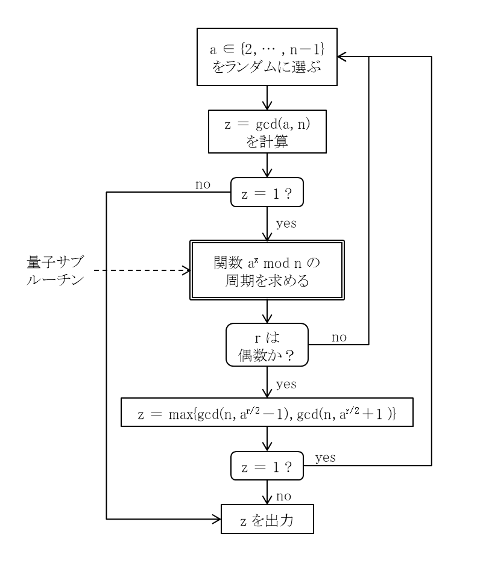
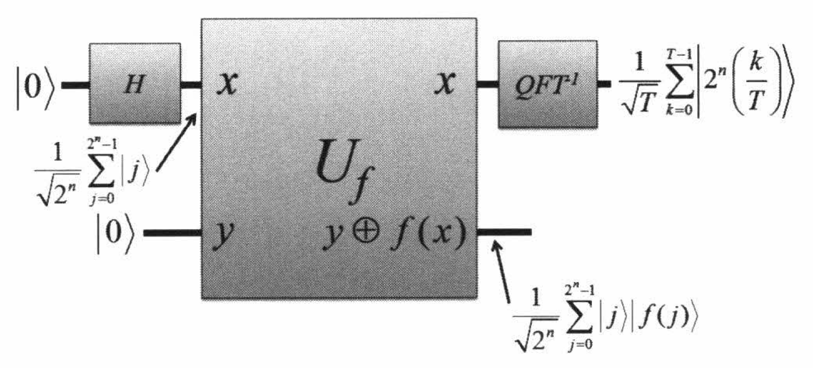
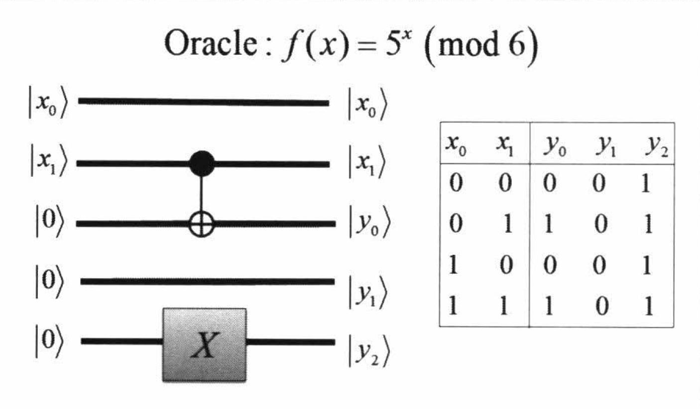
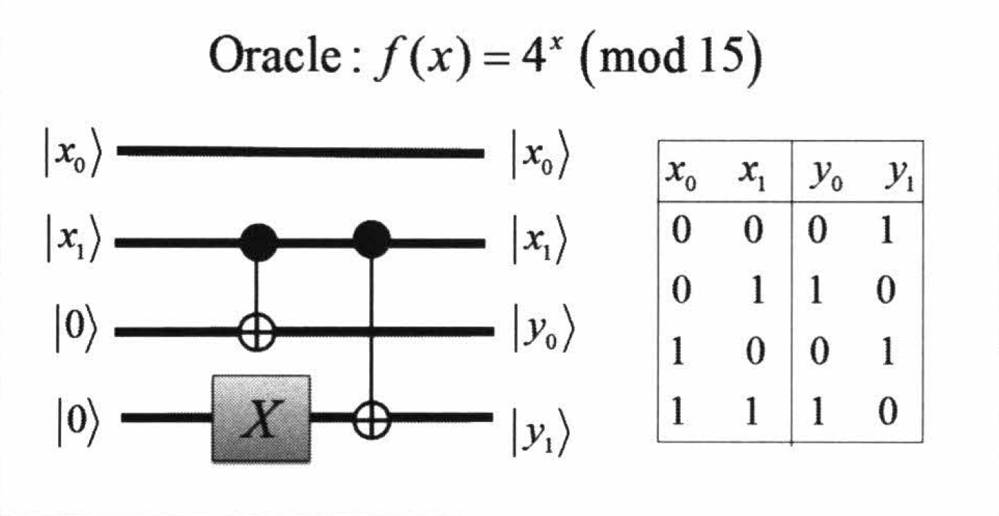
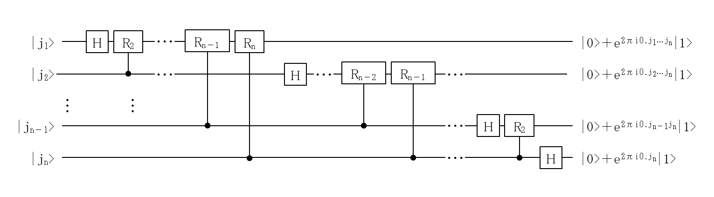

# Shor アルゴリズムについて

### はじめに TL; DR;
このノートは, ある量子コンピューターの勉強会向けに作成したものです.  

Google や IBM, Microsoft などコンピューター分野で巨人と呼ばれる企業が量子コンピューターの実現に向けて取り組んでおり, 実際の量子コンピューターを触れる機会も出てきました. そんな中, 量子コンピューターを利用するための活動は未成熟です.  
量子コンピューターを利用する様々なアルゴリズムが提案されていますが, その中で, 量子コンピューターで因数分解を行う Shor アルゴリズムと, 探索のための Grover のアルゴリズムが有名です. 
このエントリでは, Shor のアルゴリズムについてご紹介します.  

SSL（Secure Socket Layer）という暗号化の技術によって, 一般的なWebサービスの通信経路のセキュリティを保証されています.  
この SSL の技術背景には, 「因数分解が多項式時間では解けない. 」という計算科学の理論的な裏づけがあり, 誰からも安全であると信じられています.  
「多項式時間ではとけない」とは, 現在のコンピューターでは現実的に有効な時間で解を求められないということです.  
しかし, 量子コンピューターが実現すると, この因数分解が多項式時間で解けてしまうと言われています.  

果てして, それは正しいのでしょうか？理論的には, 現在のコンピューターではなく, 万能性のある（昨今では「ゲート型」と呼ばれる）量子コンピューターでは, 
「因数分解が多項式時間で解ける」ようになります.  

### RSA 暗号の安全性と Shor のアルゴリズム

SSL認証の元となっているRSA暗号の安全性は, 因数分解の計算困難さにより安全性が担保されております.  

十分大きな素数：p, q に対して,   
  
    p × q  から 積 N を計算する　：簡単な計算
    N から因数 p と q を取り出す　：困難な計算

この困難な計算とされている自然数の因数分解は, あくまで古典計算機を使用したときの難しさです.  
古典計算機を使った手法も, より良いアルゴリズムが研究されており, 次のような手法が存在します.  

  - Brute force method
  - ρ method（ポラード・ロー素因数分解法）
  - p-1 method
  - p+1 method
  - 連分数法（Continued Fraction Method）
  - 複数多項式二次ふるい法（MPQS : Multiple Polynomial Quadratic Sieve Method）
  - 楕円曲線法（ECM : Elliptic Curve Method）
  - 数体ふるい法 (NFS, Number field sieve) 
  
一方で, 量子計算機を使った分野では, Shor のアルゴリズムが発見されており, 
さほど難しくなく（多項式時間で解ける難しさ, という）で計算ができるようになります.  
その計算の比較は, 計算量を表す記号 $$ \mathcal{O} $$ 記法（オー記法, もしくはビッグオー記法と呼ぶ）を使って,  

* 古典コンピューター：$$ \mathcal{O}( e^{cn^{1/3}(log{n})^{2/3}} ) , c = (64/9)^{1/3} \approx 1.9 $$ ：指数時間
* 量子コンピューター：$$ \mathcal{O}( n^2 \log{n} \log \log{n} ) + \mathcal{O} (poly) $$ ：多項式時間

とされています. （出展：参考図書 *6 による. 最新研究では, より正確に計算量が求められています. ）  
次からは, 量子計算による因数分解の手法を見ていきます.  

### 因数分解のアルゴリズム

因数分解の基本的な手法を表現すると  

整数 $$ N $$ を因数分解して, $$ N = pq $$ となるような整数 $$ p, q $$ (因数) を求めるためには,  
$$  \exists a \in \{ 2, 3, \cdots  , N-1 \} : gcd(a, N) = 1 $$ である $$ a $$ に対して,   
関数 $$ f(x) = a^{x} \pmod{N} $$ が $$ f(x) = f(x + T) $$ を満たすような最小の周期  $$ T ( \gt 0 ) $$ を求め,  
  
そして, 求めた $$ T $$ について, 

    この周期 T が偶数　＝＞　問題が解けた！！！
    この周期 T が奇数　＝＞　違う a で試す

となります.   
つまり, 因数分解の問題は, 「周期性を発見する問題」に置き換えられることになります.   

そこで, 周期性を発見する問題を量子ビット（qubit）を使った例で見てみましょう.  
  
例題として, 「$$ N = 15 $$ の因数分解」を考えます.  

$$ \exists a < 15 , gcd(a, 15 ) = 1 $$ である数 $$ a = 7 $$ をとって調べます.  
ある量子状態 $$ \lvert \psi \rangle $$ を作って計算します. （具体的な計算方法と数理は後述）  

　$$ \\
\ \ \ \lvert \psi \rangle = \lvert 0 \rangle \lvert 7^0 \pmod{15} \rangle + \lvert 1 \rangle \lvert 7^1 \pmod{15} \rangle \\
\ \ \ \ \ \ \ \ \ + \lvert 2 \rangle \lvert 7^2 \pmod{15} \rangle + \lvert 3 \rangle \lvert 7^3 \pmod{15} \rangle \\
\ \ \ \ \ \ \ \ \ + \lvert 4 \rangle \lvert 7^4 \pmod{15} \rangle + \cdots + \lvert N-1 \rangle \lvert 7^{N-1} \pmod{15} \rangle \\
$$

この mod がある Ket部分を展開して,  

　$$ \\
\ \ \ \lvert \psi \rangle = \lvert 0 \rangle \lvert 1 \rangle + \lvert 1 \rangle \lvert 7 \rangle \\
\ \ \ \ \ \ \ \ \ + \lvert 2 \rangle \lvert 4 \rangle + \lvert 3 \rangle \lvert 13 \rangle \\
\ \ \ \ \ \ \ \ \ + \lvert 4 \rangle \lvert 1 \rangle + \cdots + \lvert N-1 \rangle \lvert 7^{N-1} \pmod{15}\rangle \\
$$

を計算する必要があります. しかし, 全てを計算して値を算出しなくても, その周期性がわかればよいのです.  
つまりは, もう少し式の変形を進めると,  

　$$ \\
\ \ \ \lvert \psi \rangle = ( \lvert 0 \rangle  + \lvert 4 \rangle + \lvert 8 \rangle + \cdots ) \lvert 1 \rangle \\
\ \ \ \ \ \ \ \ \ + ( \lvert 1 \rangle  + \lvert 5 \rangle + \lvert 9 \rangle + \cdots ) \lvert 7 \rangle \\
\ \ \ \ \ \ \ \ \ + ( \lvert 2 \rangle  + \lvert 6 \rangle + \lvert 10 \rangle + \cdots ) \lvert 4 \rangle \\
\ \ \ \ \ \ \ \ \ + ( \lvert 3 \rangle  + \lvert 7 \rangle + \lvert 11 \rangle + \cdots ) \lvert 13 \rangle \\
$$

となり, 周期 $$ T = 4 $$ ということがわかります.  
偶数の周期がみつかりましたので, あとは, $$ gcd ( a^{T/2} \pm １, N ) $$ を計算すればよく,  

　$$ gcd ( 7^2 \pm 1 , 15 ) =  \{ gcd(48, 15) = 3 $$ と $$ gcd(50, 15) = 5 \} $$  

が得られます.  

### Shor アルゴリズムの概要

#### 周期発見のアウトライン

このアルゴリズムでは, ２つの量子ビット列を用います.  
準備する量子ビット列を, $$ n $$ 個の量子ビット（qubit）を Ketベクトル $$ \lvert q_l \rangle \lvert q_m \rangle $$ で表します.  
これを初期状態として, $$ \lvert 0 \rangle \lvert 0 \rangle  $$ と初期化してから操作を始めます.  

Step 1）  
１つめの量子ビット列 $$ \lvert q_l \rangle $$ に, 同じ振幅の重ね合わせ状態を作ります.  

　$$ \displaystyle \ \ \ \ \ \ \ \ \
   \lvert 0 \rangle \lvert 0 \rangle 
   \longrightarrow
   \frac{1}{\sqrt{n}}\sum_{a \le n} \lvert a \rangle \lvert 0 \rangle
$$

Step 2）  
１つめの量子ビット列 $$ \lvert q_l \rangle $$ を入力として, 関数 $$ f(x) $$ の出力を, ２つめの量子ビット列 $$ \lvert q_m \rangle $$ へ写すようなユニタリー変換 $$ U_f $$ を行います.  

　$$ \displaystyle \ \ \ \ \ \ \ \ \
   \frac{1}{\sqrt{n}}\sum_{a \le n} \lvert a \rangle \lvert 0 \rangle
   \longrightarrow
   \frac{1}{\sqrt{n}}\sum_{a \le n} \lvert a \rangle \lvert f(a) \rangle
$$

　ここで操作されるユニタリー変換 $$ U_f $$ は, 重要で, 周期発見（位数発見ともいう）のためのオラクルです.  

Step 3）  
２つめの量子ビット列 $$ \lvert q_m \rangle $$ を計算基底で測定します. この結果, $$ z $$ が得られたとします.  

　$$ \displaystyle \ \ \ \ \ \ \ \ \
   \frac{1}{\sqrt{n}}\sum_{a \le n} \lvert a \rangle \lvert f(a) \rangle
   \longrightarrow
   \frac{1}{\sqrt{n/ \class{mathfont-r}{T}}}\sum_{a : f(a)=z} \lvert a \rangle \lvert z \rangle 
$$

　この測定結果は次のフェーズの結果には影響しないから, 測定した結果 $$ z $$ は利用しません.  
　ここで, 隠された求めるべき周期 $$ T $$ が暗黙的に（式の上で）得られます.  

Step 4）  
１つめの量子ビット列 $$ \lvert q_l \rangle $$ に逆量子フーリエ変換 ( $$ QFT^{-1} $$ ) を作用させます. 

　$$ \displaystyle \ \ \ \ \ \ \ \ \
   \frac{1}{\sqrt{n/ \class{mathfont-r}{T}}}\sum_{a : f(a)=z} \lvert a \rangle \lvert z \rangle 
   \longrightarrow
   \frac{1}{\sqrt{n/ \class{mathfont-r}{T}}} \frac{1}{\sqrt{n}} \sum_{k = 0}^{n-1} \sum_{a: f(a)=z} \omega^{ak} \lvert k \rangle \lvert z \rangle 
$$

   この状態から１つめの量子ビット列を計算基底で測定します.  すると, 結果として $$ N/T $$ の状態が１つ得られます.  

Step 5）  
得られた結果 $$ N/T $$ が１つでは確率振幅がわからないため, この Step 1）〜 Step 4）の操作を適切な回数繰り返します.  

　$$ N/T $$ の状態が, 確率 $$ 1/T $$ で得られることを複数回試行することにより, 求めるべき周期が $$ T $$ であることを得ます.  

#### 周期発見の詳細

この手順を量子回路にできるように, 詳細に数式で辿ってみます.  

　$$ \\
\displaystyle \lvert 0 \rangle \lvert 0 \rangle \xrightarrow{H \otimes I} \frac{1}{\sqrt{2^n}} \sum_{j=0}^{2^n-1} \lvert j \rangle \lvert 0 \rangle \\
\displaystyle \xrightarrow{U_f} \frac{1}{\sqrt{2^n}} \sum_{j=0}^{2^n-1} \lvert j \rangle \lvert f(j) \rangle 
\displaystyle = \frac{1}{\sqrt{2^n}} \sum_{a=0}^{T-1} \sum_{m=0}^{\frac{2^n}{T}-1} \lvert Tm+a \rangle \lvert f(Tm+a) \rangle \\
\displaystyle \xrightarrow{f(x)=f(x+T)} \frac{1}{\sqrt{2^n}} \sum_{a=0}^{T-1} \sum_{m=0}^{\frac{2^n}{T}-1} \lvert Tm+a \rangle \lvert f(a) \rangle \\
\displaystyle \xrightarrow{measured} \sqrt{\frac{T}{2^n}} \Biggl( \sum_{m=0}^{\frac{2^n}{T}-1} \lvert Tm+a_0 \rangle \Biggr) \lvert f(a_0) \rangle \\
\displaystyle \xrightarrow{QFT^{-1}} \frac{\sqrt{T}}{2^n} \sum_{m=0}^{\frac{2^n}{T}-1} \Biggl( \sum_{a=0}^{2^n-1} \omega^{-(Tm+a_0)a} \lvert a \rangle \Biggr) \lvert f(a_0) \rangle
\displaystyle = \frac{\sqrt{T}}{2^n} \sum_{a=0}^{2^n-1} \omega^{- a_0 a} \Biggl( \sum_{m=0}^{\frac{2^n}{T}-1} \omega^{-Tam} \Biggr) \lvert a \rangle \lvert f(a_0) \rangle 
\displaystyle = \frac{1}{\sqrt{T}} \sum_{k=0}^{T-1} \omega^{- a_0 2^n \bigl( \frac{k}{T} \bigr) } \lvert 2^n \bigl( \frac{k}{T} \bigr) \rangle \lvert f(a_0) \rangle \\
$$

この操作全般を図に表すと次のようになります.  

（前のスライドでご確認ください）

最後の $$ m $$ の総和は, $$ a $$ が $$ 2^n/T $$ で割り切れる $$ a = 2^n ( \frac{k}{T} ) $$ ときに, 1 になります.  
そして,  

　$$ \\
\displaystyle \sum_{m=0}^{\frac{2^n}{T}-1} \omega^{-Tam} = \begin{cases} 2^n/T & (a = 0 \mod{2^n/T}) \\ 0 & (a \ne 0 \mod{2^n/T}) \end{cases}
$$

となります. そこでこの状態を観測して, $$ \lvert s \rangle $$ が得られたとします. この 状態 $$ s $$ は,  

$$ \lvert s \rangle = \lvert 2^n \bigl( \frac{k}{T} \bigr) \rangle $$ となり, 
観測値 $$ s $$ は, $$ \displaystyle \frac{s}{2^n} = \frac{k}{T} , k \in \{0,1, \dots , T-1 \} $$ を満たします.  

つまり, $$ \displaystyle \frac{s}{2^n} $$ を既約分数にすると, $$ T $$ が求められ, この $$ T $$ が偶数であれば, 最大公約数 $$ gcd(a^{T/2} \pm 1, N) $$ をユークリッドの互除法で求めると, $$ N $$ の因数が得られます.  

#### 周期（位数）発見の回路

概要の Step 2）ででてきたオラクルとしてのユニタリー変換 $$ U_f $$ は, $$ U_f \lvert x \rangle \lvert 0 \rangle = \lvert x \rangle \lvert a^x mod N \rangle $$ とする変換です.  
この周期発見回路（変換行列）を, 一般的に考察することは可能ですが, 準備するには苦労もあるため, ここでは幾つか具体的な例を挙げるに留めます.  

詳細が知りたいというときには, 参考図書 *4 に詳しく説明があります.  

（前のスライドでご確認ください）

$$ 5^x \pmod{6} $$ の回路

$$ 4^x \pmod{15} $$ の回路

### 量子フーリエ変換

Shor のアルゴリズムを実装するには, 「量子フーリエ変換」とその逆変換である「逆量子フーリエ変換」が必要になります.  
量子フーリエ変換は, Qiita の Advent Calendar 2017 エントリ記事「[量子コンピュータでフーリエ変換すると高速フーリエ変換より高速な件](https://qiita.com/piyo7/items/d6f95876c7ec0188f991)」に詳しく解説されています. 参考にてください.  

ここでは, 少々複雑な式になりますが, パラメータ $$ n $$ を一般的化した式を取り上げます. 

一般的に, 非負の整数の集合 $$ S_n = \{ 0, 1, 2, \dots , 2^{n} - 1 \} $$ を考えるとき,  

量子フーリエ変換は, 次式で表されます.  

$$ \displaystyle \forall y \in S_n ,\ \ \ \  \tilde f (x) = \frac{1}{\sqrt{N}} \sum_{x=0}^{N-1} \omega_n^{\class{mathfont-r}{+xy}} f(x) $$
　　　ただし, $$ \Bigl( N := 2^{n}, \omega_n := \exp{(2 \pi i / N)} \Bigr) $$  

この変換を行うユニタリー行列 $$ U^{(n)} $$ は,  

$$ 2 \times 2 $$ の恒等変換行列 $$ I := \left( \begin{array}{cc} 1 & 0 \\ 0 & 1 \end{array} \right) $$ と,
$$ 2 \times 2 $$ のHadamard変換行列 $$ H := \frac{1}{\sqrt{2}} \left( \begin{array}{cc} 1 & 1 \\ 1 & -1 \end{array} \right) $$,  

量子ビットを $$ P \lvert \varphi_1 \varphi_2 \dots \varphi_n \rangle = \lvert \varphi_n \dots \varphi_2 \varphi_1 \rangle $$ のように逆順に並べ換える変換 $$ P $$,  

$$ 2 \times 2 $$ の位相変換行列 $$ R_{x,y} := \left( \begin{array}{cc} 1 & 0 \\ 0 & e^{ \class{mathfont-r}{+} 2 \pi i / 2^{k} } \end{array} \right), 
\ \ \ k = \bigl( x - y - 1 \bigr) $$ とした $$ R_{x,y} $$ の $$ n $$ 量子ビット上での制御演算子 $$ U_{x,y} $$ を使って, 次のように表されます.   

　$$ U^{(n)} = \Biggl[ \biggl( \underbrace{I \otimes \cdots \otimes I}_{n-1} \otimes H \biggr) U_{n-1,n} \cdots U_{1,n} \Biggr] \\
\ \ \ \ \ \ \ \times \Biggl[ \biggl( \underbrace{I \otimes \cdots \otimes I}_{n-2} \otimes H \otimes I \biggr) U_{n-2,n-1} \cdots U_{1,n-1} \Biggr] \\
\ \ \ \ \ \ \ \times \Biggl[ \biggl( \underbrace{I \otimes \cdots \otimes I}_{n-3} \otimes H \otimes I \otimes I \biggr) U_{n-3,n-2} \cdots U_{1,n-2} \Biggr] \\
\ \ \ \ \ \ \ \times \Biggl[ \biggl( \underbrace{I \otimes \cdots \otimes I}_{n-4} \otimes H \otimes \underbrace{I \otimes \cdots \otimes I}_{3} \biggr) U_{n-4,n-3} \cdots U_{1,n-3} \Biggr] \\
\ \ \ \ \ \ \ \times \cdots \\
\ \ \ \ \ \ \ \times \Biggl[ \biggl( \underbrace{I \otimes \cdots \otimes I}_{3} \otimes H \otimes \underbrace{I \otimes \cdots \otimes I}_{n-4} \biggr) U_{3,4} \cdots U_{1,4} \Biggr] \\
\ \ \ \ \ \ \ \times \Biggl[ \biggl( I \otimes I \otimes H \otimes \underbrace{I \otimes \cdots \otimes I}_{n-3} \biggr) U_{2,3} U_{1,3} \Biggr] \\
\ \ \ \ \ \ \ \times \Biggl[ \biggl( I \otimes H \otimes \underbrace{I \otimes \cdots \otimes I}_{n-2} \biggr) U_{1,2} \Biggr] \\
\ \ \ \ \ \ \ \times \Biggl[ \biggl( H \otimes \underbrace{I \otimes \cdots \otimes I}_{n-1} \biggr) \Biggr] \times P  \\
$$

数式では, 難しく見えますが, 量子回路にすると見やすくなります. $$ P $$ を省いた図を見てみましょう.  

#### 逆量子フーリエ変換

次に, 量子フーリエ変換の逆変換（フーリエ変換を元に戻す変換）の一般形式を示します.  

$$ \displaystyle \forall y \in S_n ,\ \ \ \  f (x) = \frac{1}{\sqrt{N}} \sum_{x=0}^{N-1} \omega_n^{\class{mathfont-r}{-xy}} \tilde f(x) $$
　　　ただし, $$ \Bigl( N := 2^{n}, \omega_n := \exp{(2 \pi i / N)} \Bigr) $$  

つまり, フーリエ変換のときの $$ \exp $$ の肩にある指数の符号が *マイナス* になった形になります.  
これは, 全体として複素共役をなればよいことになります. これをふまえると, この逆変換を行うユニタリー行列 $$ \tilde U^{(n)} $$ は,  
量子フーリエ変換を表したときの, 恒等変換 $$ I $$, Hadamard変換 $$ H $$, 逆順への置換行列 $$ P $$ と,  
位相変換行列の複素共役行列 $$ R^{\dagger}_{x,y} := \left( \begin{array}{cc} 1 & 0 \\ 0 & e^{ \class{mathfont-r}{-} 2 \pi i / 2^{k} } \end{array} \right), 
\ \ \ k = \bigl( x - y - 1 \bigr) $$ とした 
$$ R^{\dagger}_{x,y} $$ の $$ n $$ 量子ビット上での制御演算子 $$ \tilde U_{x,y} $$ を使って, 次のように表されます.   

　$$ \tilde U^{(n)} = 
P \times \Biggl[ \biggl( H \otimes \underbrace{I \otimes \cdots \otimes I}_{n-1} \biggr) \Biggr] \\
\ \ \ \ \ \ \ \times \Biggl[ \biggl( I \otimes H \otimes \underbrace{I \otimes \cdots \otimes I}_{n-2} \biggr) \tilde U_{1,2} \Biggr] \\
\ \ \ \ \ \ \ \times \Biggl[ \biggl( I \otimes I \otimes H \otimes \underbrace{I \otimes \cdots \otimes I}_{n-3} \biggr) \tilde U_{2,3} \tilde U_{1,3} \Biggr] \\
\ \ \ \ \ \ \ \times \Biggl[ \biggl( \underbrace{I \otimes \cdots \otimes I}_{3} \otimes H \otimes \underbrace{I \otimes \cdots \otimes I}_{n-4} \biggr) \tilde U_{3,4} \cdots \tilde U_{1,4} \Biggr] \\
\ \ \ \ \ \ \ \times \cdots \\
\ \ \ \ \ \ \ \times \Biggl[ \biggl( \underbrace{I \otimes \cdots \otimes I}_{n-4} \otimes H \otimes \underbrace{I \otimes \cdots \otimes I}_{3} \biggr) \tilde U_{n-4,n-3} \cdots \tilde U_{1,n-3} \Biggr] \\
\ \ \ \ \ \ \ \times \Biggl[ \biggl( \underbrace{I \otimes \cdots \otimes I}_{n-3} \otimes H \otimes I \otimes I \biggr) \tilde U_{n-3,n-2} \cdots \tilde U_{1,n-2} \Biggr] \\
\ \ \ \ \ \ \ \times \Biggl[ \biggl( \underbrace{I \otimes \cdots \otimes I}_{n-2} \otimes H \otimes I \biggr) \tilde U_{n-2,n-1} \cdots \tilde U_{1,n-1} \Biggr] \\
\ \ \ \ \ \ \ \times \Biggl[ \biggl( \underbrace{I \otimes \cdots \otimes I}_{n-1} \otimes H \biggr) \tilde U_{n-1,n} \cdots \tilde U_{1,n} \Biggr] \\
$$

<!-- 未稿

-->

## 参考図書紹介

今回, Shor アルゴリズムを勉強するために参考にした市販書籍を下表にまとめました. 

|No.|表紙|タイトル|
|:--|:-:|:--|:--|
|*1| | [量子コンピュータと量子通信〈2〉量子コンピュータとアルゴリズム](https://www.amazon.co.jp/dp/4274200086/)  Michael A. Nielsen/ Isaac L. Chuang (著) 木村 達也 (訳), オーム社 ￥3,800, 2005/1/10 |
|*2| | [量子アルゴリズム](https://www.amazon.co.jp/dp/4765533433/) 中山 茂 (著), 技報堂出版 ￥5,400, 2014/10/30 |
|*3| | [クラウド量子計算入門](https://www.amazon.co.jp/dp/4877834087/) 中山 茂 (著), カットシステム ￥5,500, 2016/10/10 |
|*4| | [量子コンピュータの基礎数理](https://www.amazon.co.jp/dp/4339023760/) 上坂 吉則 (著), コロナ社 ￥3,000, 2000/5/26 |
|*5| | [量子情報科学入門](https://www.amazon.co.jp/dp/4320122992/)  石坂 智/ 小川 朋宏/ 河内 亮周/ 木村 元/ 林 正人 (著), 共立出版 ￥3,800, 2012/6/10 |
|*6| | [量子コンピューティング](https://www.amazon.co.jp/dp/4627827911/)   Jozef Gruska (著) 伊藤 正美/ 岩本 宙造/ 森田 憲一/ 今井 克暢/ 外山 政文 (訳) , 森北出版 ￥8,000, 2003/11/19 |

### 更新記録
2017/12/08 初版  
